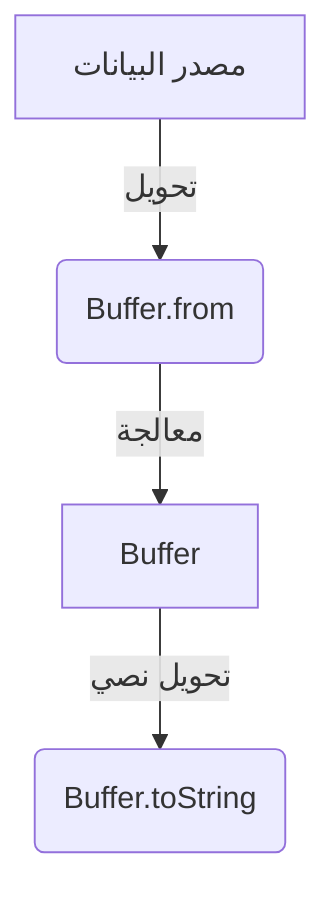

# buffer (التعامل مع البيانات الثنائية في Node.js)

## الوصف
يوفر موديول Buffer واجهة قوية للتعامل مع البيانات الثنائية (binary data) في Node.js، ويُستخدم في عمليات الملفات، الشبكات، التشفير، وبناء البروتوكولات منخفضة المستوى. Buffer هو مصفوفة بايتات ثابتة الطول، ويُستخدم بكثرة في عمليات القراءة/الكتابة منخفضة المستوى.

---

## فهرس شامل للدوال والكلاسات

| الدالة/الكلاس | الوصف |
|---------------|-------|
| [`Buffer.alloc`](#bufferallocsize-fill-encoding) | إنشاء Buffer جديد مملوء بالأصفار |
| [`Buffer.allocUnsafe`](#bufferallocunsafesize) | إنشاء Buffer غير مهيأ (أسرع لكن غير آمن) |
| [`Buffer.from`](#bufferfromarray-string-buffer-encoding) | إنشاء Buffer من مصفوفة أو نص أو Buffer آخر |
| [`Buffer.isBuffer`](#bufferisbufferobj) | التحقق هل الكائن Buffer |
| [`Buffer.byteLength`](#bufferbytelengthstring-encoding) | حساب حجم البيانات بالبايت |
| [`Buffer.compare`](#buffercomparebufa-bufb) | مقارنة بافرين |
| [`Buffer.concat`](#bufferconcatlist-totallength) | دمج عدة بافرات |
| [`Buffer.isEncoding`](#bufferisencodingencoding) | التحقق من دعم الترميز |
| [`Buffer.poolSize`](#bufferpoolsize) | حجم تجمع الذاكرة الافتراضي |
| [`buf.readUInt8`](#bufreaduint8offset) | قراءة قيمة من البافر |
| [`buf.write`](#bufwritestring-offset-length-encoding) | كتابة نص في البافر |
| [`buf.toString`](#buftostringencoding-start-end) | تحويل البافر إلى نص |
| [`buf.slice`](#bufslicestart-end) | قص جزء من البافر (بدون نسخ) |
| [`buf.subarray`](#bufsubarraystart-end) | جزء من البافر (بدون نسخ) |
| [`buf.copy`](#bufcopytarget-targetstart-sourcestart-sourceend) | نسخ بيانات بين بافرات |
| [`buf.equals`](#bufequalsotherbuffer) | مقارنة بافرين للمساواة |
| [`buf.fill`](#buffillvalue-offset-end-encoding) | تعبئة البافر بقيمة |
| [`buf.indexOf`](#bufindexofvalue-byteoffset-encoding) | البحث عن قيمة |
| [`buf.includes`](#bufincludesvalue-byteoffset-encoding) | التحقق من وجود قيمة |
| [`buf.toJSON`](#buftojson) | تحويل البافر إلى JSON |
| [`buf.readInt16LE`](#bufreadint16leoffset) / [`buf.writeInt16LE`](#bufwriteint16levalue-offset) | قراءة/كتابة أعداد صحيحة |
| [`Buffer.Blob`](#bufferblob) | كائن Blob للبيانات الثنائية |
| [`Buffer.SlowBuffer`](#bufferslowbuffersize) | بافر بطيء (للتوافقية فقط) |

---

## شرح الدوال والكلاسات الأساسية (أمثلة وبارامترات)

### Buffer.alloc(size[, fill[, encoding]])
- **size**: حجم البافر بالبايت (Integer)
- **fill**: القيمة الافتراضية (String | Buffer | Integer, اختياري)
- **encoding**: الترميز إذا كان fill نص (String, افتراضي 'utf8')
- **الوصف**: إنشاء Buffer جديد مملوء بالأصفار أو بقيمة محددة.
- **مثال:**
```js
const buf1 = Buffer.alloc(10); // 10 بايت أصفار
const buf2 = Buffer.alloc(10, 1); // 10 بايت بقيمة 1
```
[توثيق رسمي](https://nodejs.org/docs/latest/api/buffer.html#bufferallocsize-fill-encoding)

---

### Buffer.allocUnsafe(size)
- **size**: حجم البافر (Integer)
- **الوصف**: إنشاء Buffer غير مهيأ (أسرع لكن قد يحتوي بيانات قديمة).
- **مثال:**
```js
const buf3 = Buffer.allocUnsafe(10); // قد يحتوي بيانات قديمة
```
[توثيق رسمي](https://nodejs.org/docs/latest/api/buffer.html#bufferallocunsafesize)

---

### Buffer.from(array | string | buffer[, encoding])
- **array**: مصفوفة أرقام
- **string**: نص
- **buffer**: بافر آخر
- **encoding**: الترميز (String, افتراضي 'utf8')
- **الوصف**: إنشاء Buffer من مصفوفة أو نص أو Buffer آخر.
- **مثال:**
```js
const buf4 = Buffer.from([1, 2, 3]);
const buf5 = Buffer.from('hello', 'utf8');
const buf6 = Buffer.from(buf4);
```
[توثيق رسمي](https://nodejs.org/docs/latest/api/buffer.html#bufferfromarray)

---

### Buffer.isBuffer(obj)
- **obj**: الكائن المراد اختباره
- **الوصف**: التحقق هل الكائن Buffer.
- **مثال:**
```js
Buffer.isBuffer(buf4); // true
Buffer.isBuffer({}); // false
```
[توثيق رسمي](https://nodejs.org/docs/latest/api/buffer.html#bufferisbufferobj)

---

### Buffer.byteLength(string[, encoding])
- **string**: النص أو البافر
- **encoding**: الترميز (String, افتراضي 'utf8')
- **الوصف**: حساب حجم البيانات بالبايت.
- **مثال:**
```js
Buffer.byteLength('abc'); // 3
Buffer.byteLength('مرحبا'); // 10
```
[توثيق رسمي](https://nodejs.org/docs/latest/api/buffer.html#bufferbytelengthstring-encoding)

---

### Buffer.compare(bufA, bufB)
- **bufA, bufB**: البافرين للمقارنة (Buffer)
- **الوصف**: مقارنة بافرين (ترتيب بايتات).
- **مثال:**
```js
Buffer.compare(Buffer.from('a'), Buffer.from('b')); // -1
```
[توثيق رسمي](https://nodejs.org/docs/latest/api/buffer.html#buffercomparebuf1-buf2)

---

### Buffer.concat(list[, totalLength])
- **list**: قائمة البافر (Array<Buffer>)
- **totalLength**: الطول الكلي (Integer, اختياري)
- **الوصف**: دمج عدة بافرات في بافر واحد.
- **مثال:**
```js
const merged = Buffer.concat([buf4, buf5]);
```
[توثيق رسمي](https://nodejs.org/docs/latest/api/buffer.html#bufferconcatlist-totallength)

---

### Buffer.isEncoding(encoding)
- **encoding**: الترميز (String)
- **الوصف**: التحقق من دعم الترميز.
- **مثال:**
```js
Buffer.isEncoding('utf8'); // true
Buffer.isEncoding('foo'); // false
```
[توثيق رسمي](https://nodejs.org/docs/latest/api/buffer.html#bufferisencodingencoding)

---

### Buffer.poolSize
- **الوصف**: حجم تجمع الذاكرة الافتراضي (للاستخدام الداخلي).
- **مثال:**
```js
console.log(Buffer.poolSize);
```
[توثيق رسمي](https://nodejs.org/docs/latest/api/buffer.html#bufferpoolsize)

---

### buf.readUInt8(offset)
- **offset**: موقع القراءة (Integer)
- **الوصف**: قراءة قيمة من البافر.
- **مثال:**
```js
const value = buf4.readUInt8(0); // 1
```
[توثيق رسمي](https://nodejs.org/docs/latest/api/buffer.html#bufreaduint8offset)

---

### buf.write(string[, offset[, length]][, encoding])
- **string**: النص المراد كتابته (String)
- **offset**: موقع البداية (Integer, افتراضي 0)
- **length**: عدد البايتات (Integer, اختياري)
- **encoding**: الترميز (String, افتراضي 'utf8')
- **الوصف**: كتابة نص في البافر.
- **مثال:**
```js
const buf7 = Buffer.alloc(10);
buf7.write('abc', 0, 3, 'utf8');
```
[توثيق رسمي](https://nodejs.org/docs/latest/api/buffer.html#bufwritestring-offset-length-encoding)

---

### buf.toString([encoding[, start[, end]]])
- **encoding**: الترميز (String, افتراضي 'utf8')
- **start**: البداية (Integer, افتراضي 0)
- **end**: النهاية (Integer, افتراضي buffer.length)
- **الوصف**: تحويل البافر إلى نص.
- **مثال:**
```js
const str = buf5.toString('utf8'); // 'hello'
```
[توثيق رسمي](https://nodejs.org/docs/latest/api/buffer.html#buftostringencoding-start-end)

---

### buf.slice([start[, end]])
- **start**: البداية (Integer)
- **end**: النهاية (Integer)
- **الوصف**: قص جزء من البافر (بدون نسخ).
- **مثال:**
```js
const part = buf5.slice(1, 3); // Buffer يحتوي 'el'
```
[توثيق رسمي](https://nodejs.org/docs/latest/api/buffer.html#bufslicestart-end)

---

### buf.subarray([start[, end]])
- **start**: البداية (Integer)
- **end**: النهاية (Integer)
- **الوصف**: جزء من البافر (بدون نسخ فعلي).
- **مثال:**
```js
const sub = buf5.subarray(1, 3);
```
[توثيق رسمي](https://nodejs.org/docs/latest/api/buffer.html#bufsubarraystart-end)

---

### buf.copy(target[, targetStart[, sourceStart[, sourceEnd]]])
- **target**: البافر الهدف
- **targetStart**: بداية النسخ في الهدف
- **sourceStart**: بداية النسخ في المصدر
- **sourceEnd**: نهاية النسخ في المصدر
- **الوصف**: نسخ بيانات بين بافرات.
- **مثال:**
```js
const a = Buffer.from('abc');
const b = Buffer.alloc(3);
a.copy(b);
```
[توثيق رسمي](https://nodejs.org/docs/latest/api/buffer.html#bufcopytarget-targetstart-sourcestart-sourceend)

---

### buf.equals(otherBuffer)
- **otherBuffer**: البافر الآخر
- **الوصف**: مقارنة بافرين للمساواة.
- **مثال:**
```js
const a = Buffer.from('abc');
const b = Buffer.from('abc');
a.equals(b); // true
```
[توثيق رسمي](https://nodejs.org/docs/latest/api/buffer.html#bufequalsotherbuffer)

---

### buf.fill(value[, offset[, end]][, encoding])
- **value**: القيمة (String | Buffer | Integer)
- **offset**: البداية (Integer)
- **end**: النهاية (Integer)
- **encoding**: الترميز (String)
- **الوصف**: تعبئة البافر بقيمة محددة.
- **مثال:**
```js
const buf8 = Buffer.alloc(5);
buf8.fill('a');
```
[توثيق رسمي](https://nodejs.org/docs/latest/api/buffer.html#buffillvalue-offset-end-encoding)

---

### buf.indexOf(value[, byteOffset][, encoding])
- **value**: القيمة (String | Buffer | Integer)
- **byteOffset**: البداية (Integer)
- **encoding**: الترميز (String)
- **الوصف**: البحث عن قيمة في البافر.
- **مثال:**
```js
const idx = Buffer.from('hello').indexOf('e'); // 1
```
[توثيق رسمي](https://nodejs.org/docs/latest/api/buffer.html#bufindexofvalue-byteoffset-encoding)

---

### buf.includes(value[, byteOffset][, encoding])
- **value**: القيمة (String | Buffer | Integer)
- **byteOffset**: البداية (Integer)
- **encoding**: الترميز (String)
- **الوصف**: التحقق من وجود قيمة في البافر.
- **مثال:**
```js
Buffer.from('hello').includes('ll'); // true
```
[توثيق رسمي](https://nodejs.org/docs/latest/api/buffer.html#bufincludesvalue-byteoffset-encoding)

---

### buf.toJSON()
- **الوصف**: تحويل البافر إلى JSON.
- **مثال:**
```js
const json = buf4.toJSON();
```
[توثيق رسمي](https://nodejs.org/docs/latest/api/buffer.html#buftojson)

---

### buf.readInt16LE(offset) / buf.writeInt16LE(value, offset)
- **offset**: الموقع (Integer)
- **value**: القيمة (Integer)
- **الوصف**: قراءة/كتابة أعداد صحيحة (LE/BE)
- **مثال:**
```js
const buf9 = Buffer.alloc(2);
buf9.writeInt16LE(256, 0);
const num = buf9.readInt16LE(0); // 256
```
[توثيق رسمي](https://nodejs.org/docs/latest/api/buffer.html#bufreadint16leoffset)

---

### Buffer.Blob
- **الوصف**: كائن Blob لتجميع البيانات الثنائية (جديد نسبيًا، متوافق مع Web API)
- **مثال:**
```js
const blob = new Buffer.Blob([Buffer.from('hello')]);
```
[توثيق رسمي](https://nodejs.org/docs/latest/api/buffer.html#bufferblob)

---

### Buffer.SlowBuffer(size)
- **الوصف**: بافر بطيء (للتوافقية فقط، لا يُنصح باستخدامه)
- **مثال:**
```js
const slow = Buffer.SlowBuffer(10);
```
[توثيق رسمي](https://nodejs.org/docs/latest/api/buffer.html#bufferslowbuffersize)

---

## مقارنة بين الدوال المتشابهة

| المعيار            | Buffer.alloc()      | Buffer.allocUnsafe() |
|--------------------|--------------------|----------------------|
| الأمان             | آمن                | غير آمن              |
| السرعة             | أبطأ               | أسرع                 |
| الاستخدام          | افتراضي            | عند الحاجة للأداء    |

---

## حالات الاستخدام الشائعة
- التعامل مع الملفات الثنائية (صور، فيديو، إلخ)
- معالجة البيانات من الشبكة أو البروتوكولات منخفضة المستوى
- التشفير وفك التشفير
- بناء بروتوكولات خاصة

---

## أفضل الممارسات
- استخدم Buffer.alloc بدلاً من Buffer() أو Buffer.allocUnsafe إلا عند الحاجة للأداء العالي مع معالجة القيم.
- تحقق من نوع البيانات قبل التحويل إلى Buffer.
- تعامل مع الترميزات بشكل صريح (utf8, base64, ...).
- لا تستخدم Buffer مباشرة مع مدخلات المستخدم دون تحقق.

---

## التحذيرات الأمنية
- لا تستخدم Buffer.allocUnsafe مع بيانات حساسة.
- تحقق من حجم البيانات قبل الكتابة في Buffer لتجنب تجاوز السعة (buffer overflow).
- لا تعرض محتوى Buffer مباشرة للمستخدم النهائي.

---

## أدوات التصحيح
- استخدم console.log(buffer) لمعاينة البيانات.
- استخدم buffer.toString('hex') أو ('base64') لتحويل البيانات لتمثيل نصي.

---

## التوافق مع الإصدارات
- Buffer.alloc و Buffer.from متوفرة منذ Node.js 6+
- Buffer.Blob متوفرة منذ Node.js 15+
- Buffer() (بدون new) مهمل منذ Node.js 6+

---

## مخطط Mermaid


---

## اختبار تفاعلي
```js
const test = require('node:test');
const assert = require('node:assert');
const { Buffer } = require('buffer');

test('Buffer alloc/write/read', () => {
  const buf = Buffer.alloc(4);
  buf.writeUInt16LE(513, 0);
  assert.strictEqual(buf.readUInt16LE(0), 513);
});
```

---

## الأخطاء الشائعة
- [❌] استخدام Buffer.allocUnsafe دون تعبئة → الحل: استخدم fill مباشرة بعد الإنشاء.
- [❌] تجاوز حجم البافر عند الكتابة → الحل: تحقق من الطول قبل الكتابة.
- [❌] استخدام Buffer() (بدون new) → الحل: استخدم Buffer.alloc أو Buffer.from.

---

## نصائح الخبراء
- [💡] استخدم Buffer.from لتحويل النصوص أو المصفوفات إلى بيانات ثنائية.
- [🚀] استخدم Buffer.concat لدمج عدة بافرات بكفاءة.
- [⚠️] تعامل مع الترميزات بحذر عند التحويل بين Buffer ونصوص.
- [💡] استخدم Buffer.isBuffer للتحقق من نوع الكائن قبل العمليات.
- [🚀] استخدم Buffer.allocUnsafe فقط في حالات الأداء العالي ومع معالجة القيم فورًا.

--- 

---

## أمثلة شاملة متقدمة

### مثال 1: قراءة صورة ثنائية وتغيير بعض البايتات ثم حفظها
```js
const fs = require('fs');
const path = require('path');

// قراءة ملف صورة كـ Buffer
const imgPath = path.join(__dirname, 'input.jpg');
fs.readFile(imgPath, (err, buffer) => {
  if (err) return console.error('خطأ في القراءة:', err);
  // تغيير أول 10 بايتات (مثال فقط)
  buffer.fill(0xff, 0, 10);
  // حفظ الصورة المعدلة
  fs.writeFile(path.join(__dirname, 'output.jpg'), buffer, (err) => {
    if (err) return console.error('خطأ في الكتابة:', err);
    console.log('تم حفظ الصورة المعدلة!');
  });
});
```
**شرح:** هذا المثال يوضح كيف يمكن استخدام Buffer مع ملفات ثنائية حقيقية (صور)، مع معالجة الأخطاء في كل خطوة.

---

### مثال 2: استقبال بيانات من الشبكة وتجميعها في Buffer ثم تحليلها
```js
const net = require('net');
let dataBuffer = Buffer.alloc(0);
const server = net.createServer(socket => {
  socket.on('data', chunk => {
    // دمج البيانات الواردة
    dataBuffer = Buffer.concat([dataBuffer, chunk]);
    // إذا وصلنا لنهاية الرسالة (مثلاً \n)
    if (dataBuffer.includes(0x0a)) {
      console.log('استقبلنا رسالة كاملة:', dataBuffer.toString());
      dataBuffer = Buffer.alloc(0); // إعادة التهيئة
    }
  });
  socket.on('error', err => console.error('خطأ في الاتصال:', err));
});
server.listen(9000, () => console.log('خادم TCP على المنفذ 9000'));
```
**شرح:** مثال عملي على تجميع البيانات من الشبكة باستخدام Buffer، مع معالجة الأخطاء.

---

### مثال 3: مقارنة أداء Buffer.alloc وBuffer.allocUnsafe
```js
console.time('alloc');
Buffer.alloc(10_000_000);
console.timeEnd('alloc');

console.time('allocUnsafe');
Buffer.allocUnsafe(10_000_000);
console.timeEnd('allocUnsafe');
```
**شرح:** يقيس هذا المثال الفرق في الأداء بين الطريقتين ويوضح متى تختار كل واحدة.

---

### مثال 4: تحويل نصوص بين ترميزات مختلفة
```js
const { transcode } = require('buffer');
const utf8Buffer = Buffer.from('مرحبا', 'utf8');
const win1256Buffer = transcode(utf8Buffer, 'utf8', 'win1256');
console.log(win1256Buffer);
```
**شرح:** يوضح كيفية تحويل النصوص بين ترميزات مختلفة باستخدام transcode.

---

### مثال 5: التعامل مع بيانات حساسة بأمان
```js
const buf = Buffer.allocUnsafe(32);
// يجب تعبئة البافر مباشرة لتجنب تسرب بيانات قديمة
buf.fill(0);
// ... استخدم البافر في عمليات حساسة ...
```
**شرح:** يوضح أهمية تعبئة Buffer غير الآمن قبل استخدامه مع بيانات حساسة.

--- 