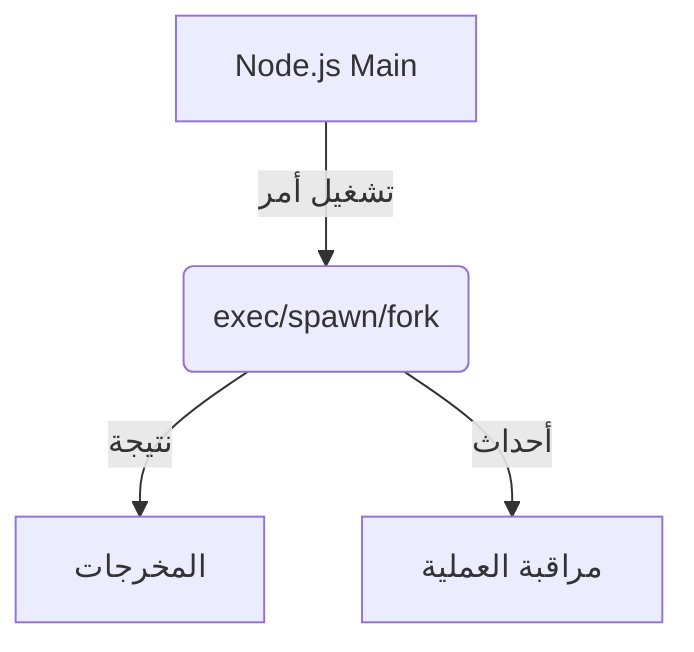

# child_process (تشغيل العمليات الفرعية في Node.js)

## الوصف
يوفر موديول child_process واجهة قوية لتشغيل أوامر النظام أو برامج خارجية أو نصوص Node.js كعمليات فرعية. يُستخدم في تنفيذ سكريبتات، إدارة عمليات، بناء خطوط معالجة (pipelines)، أو توزيع الحمل بين العمليات.

---

## فهرس شامل للدوال والكلاسات
| الدالة/الكلاس | الوصف |
|---------------|-------|
| [`child_process.exec`](#child_processexeccommand-options-callback) | تنفيذ أمر نظامي بسيط |
| [`child_process.spawn`](#child_processspawncommand-args-options) | تنفيذ أمر مع تحكم كامل في الإدخال/الإخراج |
| [`child_process.execSync`](#child_processexecsynccommand-options) | تنفيذ أمر بشكل متزامن |
| [`child_process.spawnSync`](#child_processspawnsynccommand-args-options) | تنفيذ أمر متزامن مع تحكم في الإدخال/الإخراج |
| [`child_process.fork`](#child_processforkmodulepath-args-options) | تنفيذ نص برمجي كعملية فرعية |
| [`ChildProcess`](#class-childprocess) | كلاس يمثل العملية الفرعية |

---

## شرح الدوال والكلاسات الأساسية (أمثلة وبارامترات)

### child_process.exec(command[, options][, callback])
- **command**: الأمر المراد تنفيذه (String)
- **options**: { cwd, env, encoding, timeout, maxBuffer, shell } (Object, اختياري)
- **callback**: function(error, stdout, stderr)
- **الوصف**: تنفيذ أمر نظامي بسيط (مناسب للأوامر القصيرة).
- **مثال:**
```js
const { exec } = require('child_process');
exec('node -v', (error, stdout, stderr) => {
  if (error) return console.error('خطأ في التنفيذ:', error);
  console.log('إصدار Node:', stdout.trim());
});
```
[توثيق رسمي](https://nodejs.org/docs/latest/api/child_process.html#child_processexeccommand-options-callback)

---

### child_process.spawn(command[, args][, options])
- **command**: اسم البرنامج أو الأمر (String)
- **args**: مصفوفة بارامترس للأمر (Array, اختياري)
- **options**: { cwd, env, stdio, detached, shell } (Object, اختياري)
- **الوصف**: تنفيذ أمر مع التحكم الكامل في الإدخال/الإخراج.
- **مثال:**
```js
const { spawn } = require('child_process');
const ls = spawn('ls', ['-lh', '/usr']);
ls.stdout.on('data', (data) => {
  console.log('المخرجات:', data.toString());
});
ls.stderr.on('data', (data) => {
  console.error('خطأ:', data.toString());
});
ls.on('close', (code) => {
  console.log('انتهت العملية بكود:', code);
});
```
[توثيق رسمي](https://nodejs.org/docs/latest/api/child_process.html#child_processspawncommand-args-options)

---

### child_process.execSync(command[, options])
- **command**: الأمر (String)
- **options**: { cwd, env, encoding, timeout, maxBuffer, stdio, shell } (Object, اختياري)
- **الوصف**: تنفيذ أمر وانتظار النتيجة (synchronous, يحجب الـ event loop).
- **مثال:**
```js
const { execSync } = require('child_process');
const version = execSync('node -v', { encoding: 'utf8' });
console.log('إصدار Node:', version.trim());
```
[توثيق رسمي](https://nodejs.org/docs/latest/api/child_process.html#child_processexecsynccommand-options)

---

### child_process.spawnSync(command[, args][, options])
- **command**: اسم البرنامج (String)
- **args**: مصفوفة بارامترس (Array, اختياري)
- **options**: { cwd, env, input, stdio, shell, encoding } (Object, اختياري)
- **الوصف**: تنفيذ أمر بشكل متزامن مع التحكم في الإدخال/الإخراج.
- **مثال:**
```js
const { spawnSync } = require('child_process');
const result = spawnSync('ls', ['-lh', '/usr'], { encoding: 'utf8' });
console.log('المخرجات:', result.stdout);
```
[توثيق رسمي](https://nodejs.org/docs/latest/api/child_process.html#child_processspawnsynccommand-args-options)

---

### child_process.fork(modulePath[, args][, options])
- **modulePath**: مسار ملف جافاسكريبت (String)
- **args**: مصفوفة بارامترس (Array, اختياري)
- **options**: { cwd, env, execPath, execArgv, stdio, detached } (Object, اختياري)
- **الوصف**: تنفيذ نص برمجي كعملية فرعية (يُستخدم مع node غالباً).
- **مثال:**
```js
const { fork } = require('child_process');
const child = fork('worker.js', ['--mode', 'test']);
child.on('message', (msg) => {
  console.log('رسالة من العملية الفرعية:', msg);
});
child.send({ hello: 'world' });
```
[توثيق رسمي](https://nodejs.org/docs/latest/api/child_process.html#child_processforkmodulepath-args-options)

---

### Class: ChildProcess
- **الوصف**: يمثل العملية الفرعية الناتجة عن exec/spawn/fork.
- **أهم الأحداث:**
  - `'exit'`: عند انتهاء العملية
  - `'close'`: عند إغلاق جميع الـ stdio
  - `'error'`: عند حدوث خطأ
  - `'message'`: عند استقبال رسالة (مع fork فقط)
- **أهم الخصائص:**
  - `pid`: رقم العملية الفرعية
  - `stdin`, `stdout`, `stderr`: Streams للإدخال/الإخراج
- **مثال:**
```js
const { spawn } = require('child_process');
const child = spawn('ls');
child.on('exit', (code) => {
  console.log('انتهت العملية بكود:', code);
});
```
[توثيق رسمي](https://nodejs.org/docs/latest/api/child_process.html#class-childprocess)

---

## مقارنة بين الدوال المتشابهة
| المعيار            | exec                | spawn               | fork                |
|--------------------|---------------------|---------------------|---------------------|
| التحكم في الإدخال   | محدود (stdout فقط)  | كامل (Streams)      | كامل (Streams + IPC)|
| الأمان             | أقل (خطر حقن أوامر) | أعلى (args Array)   | أعلى (Node فقط)     |
| الأداء             | جيد للأوامر القصيرة | أفضل للأوامر الطويلة| ممتاز لعمليات Node  |
| التواصل            | نصوص فقط            | Streams             | رسائل (IPC)         |
| متزامن             | execSync            | spawnSync           | لا يوجد             |

---

## حالات الاستخدام الشائعة
- تنفيذ أوامر النظام من تطبيق Node.js
- بناء خطوط معالجة (pipelines) بين العمليات
- تشغيل سكريبتات أو برامج خارجية
- بناء أنظمة مراقبة أو إدارة عمليات
- توزيع الحمل (load balancing) في تطبيقات Node.js

---

## أفضل الممارسات
- استخدم spawn مع مصفوفة بارامترس لتجنب حقن الأوامر
- استمع دائماً للأحداث ('error', 'close', 'exit') وعالج الأخطاء
- حدد maxBuffer في exec/execSync إذا كنت تتوقع مخرجات كبيرة
- استخدم stdio: 'inherit' في spawn/spawnSync لتمرير الإدخال/الإخراج للطرفية
- تجنب الدوال المتزامنة (Sync) في بيئة الخوادم
- لا تمرر مدخلات المستخدم مباشرة إلى exec أو shell

---

## التحذيرات الأمنية
- لا تمرر مدخلات المستخدم مباشرة إلى exec أو shell
- راقب المخرجات الكبيرة لتفادي امتلاء الذاكرة
- لا تستخدم الدوال المتزامنة في تطبيقات الخادم
- تحقق من صلاحيات المستخدم قبل تنفيذ أوامر حساسة

---

## أدوات التصحيح
- [node --inspect](https://nodejs.org/en/docs/guides/debugging-getting-started/)
- [pm2](https://pm2.keymetrics.io/) (لإدارة العمليات والمراقبة)
- استخدم child.on('error', ...) لرصد الأخطاء

---

## التوافق مع الإصدارات
- جميع الدوال الأساسية متوفرة منذ Node.js 0.8+
- بعض الخيارات المتقدمة أضيفت في Node.js 10+

---

## مخطط Mermaid


---

## اختبار تفاعلي
```js
const test = require('node:test');
const assert = require('node:assert');
const { exec } = require('child_process');

test('exec يعمل بدون خطأ', (t, done) => {
  exec('node -v', (error, stdout, stderr) => {
    assert.ok(stdout.includes('v'));
    done();
  });
});
```

---

## الأخطاء الشائعة
- [❌] تمرير مدخلات المستخدم مباشرة إلى exec → الحل: استخدم spawn مع مصفوفة بارامترس.
- [❌] تجاهل الأحداث ('error', 'close') → الحل: استمع دائماً للأحداث وعالج الأخطاء.
- [❌] استخدام الدوال المتزامنة في الخادم → الحل: استخدم الدوال غير المتزامنة.
- [❌] عدم تحديد maxBuffer في exec مع أوامر ذات مخرجات كبيرة.

---

## نصائح الخبراء
- [💡] استخدم الأحداث ('exit', 'close', 'error') لمراقبة حالة العملية الفرعية.
- [🚀] استخدم fork لتشغيل عمليات Node.js فرعية والتواصل بينها عبر الرسائل (IPC).
- [⚠️] لا تمرر مدخلات المستخدم مباشرة إلى exec أو shell.
- [💡] استخدم stdio: 'inherit' لتمرير الإدخال/الإخراج للطرفية.
- [🚀] استخدم spawn للأوامر الطويلة أو التي تحتاج Streams.

--- 

---

## أمثلة شاملة متقدمة

### مثال 1: تنفيذ أمر نظامي مع قراءة المخرجات وحفظها في ملف
```js
const { exec } = require('child_process');
const fs = require('fs');
exec('ls -lh', (error, stdout, stderr) => {
  if (error) return console.error('خطأ في التنفيذ:', error);
  fs.writeFile('output.txt', stdout, err => {
    if (err) return console.error('خطأ في الحفظ:', err);
    console.log('تم حفظ المخرجات في output.txt');
  });
});
```
**شرح:** ينفذ أمر نظامي ويخزن المخرجات في ملف مع معالجة الأخطاء.

---

### مثال 2: بناء خط معالجة (pipeline) بين عمليتين فرعيتين
```js
const { spawn } = require('child_process');
const grep = spawn('grep', ['node']);
const ps = spawn('ps', ['aux']);
ps.stdout.pipe(grep.stdin);
grep.stdout.on('data', data => {
  console.log('العمليات التي تحتوي على node:', data.toString());
});
ps.on('error', err => console.error('خطأ في ps:', err));
grep.on('error', err => console.error('خطأ في grep:', err));
```
**شرح:** يوضح كيفية ربط عمليتين فرعيتين عبر الأنابيب.

---

### مثال 3: استخدام fork للتواصل بين العمليات
```js
// main.js
const { fork } = require('child_process');
const child = fork('worker.js');
child.on('message', msg => {
  console.log('رسالة من العامل:', msg);
});
child.send({ action: 'start' });
```
```js
// worker.js
process.on('message', msg => {
  if (msg.action === 'start') {
    process.send({ status: 'تم البدء' });
  }
});
```
**شرح:** مثال عملي على التواصل بين العمليات باستخدام fork والرسائل.

---

### مثال 4: التعامل مع أوامر ذات مخرجات ضخمة بأمان
```js
const { exec } = require('child_process');
exec('cat ملف_ضخم.txt', { maxBuffer: 1024 * 1024 }, (err, stdout, stderr) => {
  if (err) return console.error('خطأ:', err);
  console.log('تمت القراءة بنجاح');
});
```
**شرح:** يوضح أهمية ضبط maxBuffer عند التعامل مع مخرجات كبيرة.

---

### مثال 5: التعامل مع الأخطاء في العمليات الفرعية
```js
const { spawn } = require('child_process');
const child = spawn('غير_موجود');
child.on('error', err => {
  console.error('حدث خطأ متوقع:', err.message);
});
```
**شرح:** يوضح كيفية التقاط الأخطاء عند فشل تنفيذ أمر.

--- 