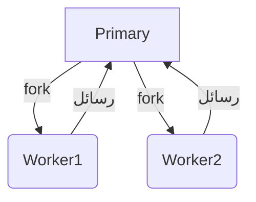

# cluster (تشغيل عدة عمليات Node.js متوازية)

## الوصف
يوفر موديول cluster واجهة لتشغيل عدة عمليات Node.js (workers) على نفس الخادم للاستفادة من جميع أنوية المعالج (CPU Cores). يسمح بتوزيع الحمل على أكثر من عملية، مما يحسن الأداء في تطبيقات الخوادم عالية الضغط.

---

## فهرس شامل للدوال والكلاسات
| الدالة/الخاصية | الوصف |
|---------------|-------|
| [`cluster.isPrimary`](#clusterisprimary) | هل العملية الأساسية؟ |
| [`cluster.isWorker`](#clusterisworker) | هل العملية عامل؟ |
| [`cluster.fork`](#clusterforkenv) | إنشاء عمليات فرعية |
| [`cluster.workers`](#clusterworkers) | جميع العمال الحاليين |
| [`cluster.on`](#clusteronevent-listener) | الاستماع لأحداث العمال |
| [`cluster.setupPrimary`](#clustersetupprimarysettings) | إعداد خصائص الكلستر |
| [`cluster.settings`](#clustersettings) | إعدادات الكلستر الحالية |
| [`cluster.schedulingPolicy`](#clusterschedulingpolicy) | سياسة توزيع الاتصالات |
| [`cluster.worker`](#clusterworker) | العامل الحالي (داخل worker) |
| [`Worker`](#class-worker) | كلاس يمثل العامل |
| [`worker.send`](#workersendmessage-sendhandle-options-callback) | إرسال رسالة بين العمليات |
| [`worker.kill`](#workerkillsignal) | إنهاء عامل |
| [`worker.disconnect`](#workerdisconnect) | قطع الاتصال مع العامل |

---

## شرح الدوال والكلاسات الأساسية (أمثلة وبارامترات)

### cluster.isPrimary
- **الوصف**: true إذا كانت العملية الأساسية (master)
- **مثال:**
```js
const cluster = require('node:cluster');
if (cluster.isPrimary) {
  // كود العملية الأساسية
}
```
[توثيق رسمي](https://nodejs.org/docs/latest/api/cluster.html#clusterisprimary)

---

### cluster.isWorker
- **الوصف**: true إذا كانت العملية عامل (worker)
- **مثال:**
```js
if (cluster.isWorker) {
  // كود العامل
}
```
[توثيق رسمي](https://nodejs.org/docs/latest/api/cluster.html#clusterisworker)

---

### cluster.fork([env])
- **env**: متغيرات البيئة للعملية الفرعية (Object, اختياري)
- **الوصف**: إنشاء عملية عامل جديدة.
- **مثال:**
```js
if (cluster.isPrimary) {
  cluster.fork({ WORKER_TYPE: 'api' });
}
```
[توثيق رسمي](https://nodejs.org/docs/latest/api/cluster.html#clusterforkenv)

---

### cluster.workers
- **الوصف**: كائن يحتوي على جميع العمال الحاليين (worker.id => worker)
- **مثال:**
```js
Object.values(cluster.workers).forEach(worker => {
  console.log(worker.id, worker.process.pid);
});
```
[توثيق رسمي](https://nodejs.org/docs/latest/api/cluster.html#clusterworkers)

---

### cluster.on(event, listener)
- **event**: اسم الحدث ('exit', 'online', ...)
- **listener**: دالة تُنفذ عند وقوع الحدث
- **الوصف**: الاستماع لأحداث العمال.
- **مثال:**
```js
cluster.on('exit', (worker, code, signal) => {
  console.log(`العامل ${worker.process.pid} خرج`);
});
```
[توثيق رسمي](https://nodejs.org/docs/latest/api/cluster.html#clusterevent)

---

### cluster.setupPrimary([settings])
- **settings**: إعدادات مثل exec, args, silent, stdio (Object)
- **الوصف**: إعداد خصائص الكلستر قبل إنشاء العمال.
- **مثال:**
```js
cluster.setupPrimary({ exec: 'worker.js', args: ['--mode', 'prod'] });
```
[توثيق رسمي](https://nodejs.org/docs/latest/api/cluster.html#clustersetupprimarysettings)

---

### cluster.settings
- **الوصف**: إعدادات الكلستر الحالية.
- **مثال:**
```js
console.log(cluster.settings);
```
[توثيق رسمي](https://nodejs.org/docs/latest/api/cluster.html#clustersettings)

---

### cluster.schedulingPolicy
- **الوصف**: سياسة توزيع الاتصالات (افتراضي: round-robin)
- **مثال:**
```js
console.log(cluster.schedulingPolicy);
```
[توثيق رسمي](https://nodejs.org/docs/latest/api/cluster.html#clusterschedulingpolicy)

---

### cluster.worker
- **الوصف**: كائن worker الحالي (داخل العامل فقط)
- **مثال:**
```js
if (cluster.isWorker) {
  console.log(cluster.worker.id);
}
```
[توثيق رسمي](https://nodejs.org/docs/latest/api/cluster.html#clusterworker)

---

### Class: Worker
- **الوصف**: يمثل العامل (worker) في الكلستر.
- **أهم الأحداث:**
  - `'disconnect'`: عند قطع الاتصال
  - `'error'`: عند حدوث خطأ
  - `'exit'`: عند انتهاء العامل
  - `'message'`: عند استقبال رسالة
- **أهم الخصائص:**
  - `id`: رقم العامل
  - `process`: كائن العملية الفرعية
  - `isConnected()`, `isDead()`: دوال حالة العامل
- **مثال:**
```js
cluster.on('online', (worker) => {
  console.log('عامل جديد:', worker.id);
});
```
[توثيق رسمي](https://nodejs.org/docs/latest/api/cluster.html#class-worker)

---

### worker.send(message[, sendHandle[, options]][, callback])
- **message**: الرسالة (Object)
- **sendHandle**: مقبض لنقله (اختياري)
- **options**: خيارات إضافية (اختياري)
- **callback**: دالة بعد الإرسال (اختياري)
- **الوصف**: إرسال رسالة بين العمليات.
- **مثال:**
```js
if (cluster.isWorker) {
  process.on('message', (msg) => {
    console.log('رسالة من الماستر:', msg);
  });
  process.send({ ready: true });
}
```
[توثيق رسمي](https://nodejs.org/docs/latest/api/cluster.html#workermessagesendhandle-options-callback)

---

### worker.kill([signal])
- **signal**: إشارة نظام (String, افتراضي SIGTERM)
- **الوصف**: إنهاء عامل.
- **مثال:**
```js
worker.kill('SIGKILL');
```
[توثيق رسمي](https://nodejs.org/docs/latest/api/cluster.html#workerkillsignal)

---

### worker.disconnect()
- **الوصف**: قطع الاتصال مع العامل.
- **مثال:**
```js
worker.disconnect();
```
[توثيق رسمي](https://nodejs.org/docs/latest/api/cluster.html#workerdisconnect)

---

## مقارنة بين cluster و child_process
| المعيار            | cluster             | child_process        |
|--------------------|--------------------|---------------------|
| الهدف              | توزيع الحمل على Node| تشغيل أي عملية      |
| التواصل            | رسائل (IPC)        | Streams/رسائل       |
| الإدارة            | تلقائي (workers)   | يدوي                |
| الاستخدام الأمثل   | خوادم HTTP/شبكات   | أوامر النظام/برامج  |

---

## حالات الاستخدام الشائعة
- توزيع الحمل على جميع أنوية المعالج في تطبيقات الخوادم
- بناء خوادم عالية التوافر (High Availability)
- مراقبة وإعادة تشغيل العمال تلقائياً
- توزيع المهام الحسابية الثقيلة

---

## أفضل الممارسات
- استخدم قاعدة بيانات أو Redis لمشاركة الحالة بين العمال
- استمع لحدث 'exit' وأعد تشغيل العمال عند الحاجة
- اختبر الكود على جميع الأنظمة المستهدفة
- لا تعتمد على cluster في إدارة التوجيه أو تكرار البيانات
- راقب صحة العمال وأعد تشغيلهم تلقائياً عند الخروج غير المتوقع

---

## التحذيرات الأمنية
- لا تشارك بيانات حساسة في الذاكرة بين العمال
- راقب العمال وأعد تشغيلهم تلقائياً عند الخروج غير المتوقع
- تحقق من صحة الرسائل المتبادلة بين العمال والماستر

---

## أدوات التصحيح
- [node --inspect](https://nodejs.org/en/docs/guides/debugging-getting-started/)
- [pm2](https://pm2.keymetrics.io/) (لإدارة العمليات والمراقبة)
- استخدم worker.on('error', ...) لرصد الأخطاء

---

## التوافق مع الإصدارات
- cluster متوفر منذ Node.js 0.8+
- بعض الأحداث والخصائص أضيفت في Node.js 16+

---

## مخطط Mermaid


---

## اختبار تفاعلي
```js
const test = require('node:test');
const assert = require('node:assert');
const cluster = require('node:cluster');

test('isPrimary/isWorker', () => {
  assert.ok(cluster.isPrimary || cluster.isWorker);
});
```

---

## الأخطاء الشائعة
- [❌] الاعتماد على مشاركة الذاكرة بين العمال → الحل: استخدم قاعدة بيانات أو Redis.
- [❌] عدم مراقبة حدث 'exit' للعمال → الحل: أعد تشغيل العمال تلقائياً عند الخروج.
- [❌] تجاهل الأخطاء في العمال → الحل: استمع دائماً للأحداث ('error', 'exit').

---

## نصائح الخبراء
- [💡] استخدم cluster لتوزيع الحمل في تطبيقات الخوادم فقط.
- [🚀] استخدم worker.send/ process.on('message') للتواصل بين العمال والماستر.
- [⚠️] لا تعتمد على cluster في مشاركة الحالة، استخدم حلول خارجية.
- [💡] اختبر الكود على جميع الأنظمة المستهدفة.
- [🚀] أعد تشغيل العمال تلقائياً عند الخروج غير المتوقع.

--- 