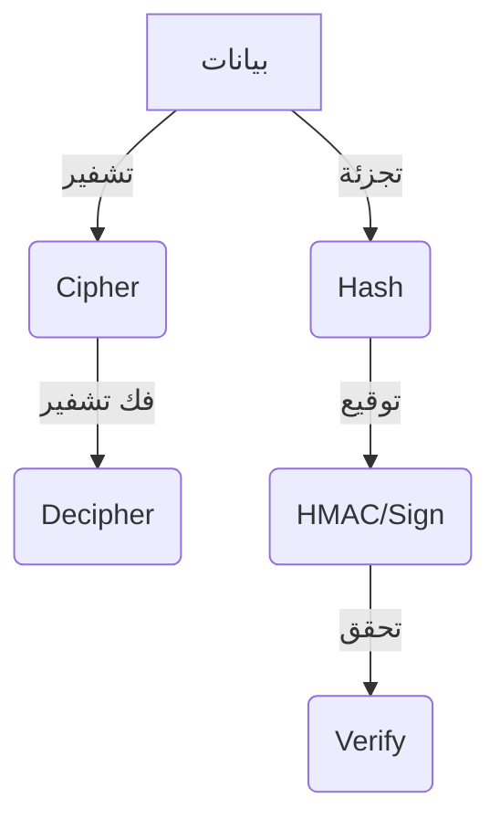

# crypto (التشفير والتجزئة في Node.js)

## الوصف
يوفر موديول crypto وظائف تشفير وتجزئة قوية في Node.js، مثل توليد القيم العشوائية، التحقق من سلامة البيانات، تشفير/فك تشفير، توقيع رقمي، وتوليد مفاتيح. يُستخدم في حماية كلمات المرور، التحقق من الهوية، تشفير البيانات، وبناء بروتوكولات آمنة.

---

## فهرس شامل للدوال والكلاسات
| الدالة/الكلاس | الوصف |
|---------------|-------|
| [`crypto.randomBytes`](#cryptorandombytessize-callback) | توليد بايتات عشوائية آمنة |
| [`crypto.randomInt`](#cryptorandomintmin-max-callback) | توليد رقم عشوائي آمن |
| [`crypto.randomUUID`](#cryptorandomuuidoptions) | توليد UUID v4 عشوائي |
| [`crypto.createHash`](#cryptocreatehashalgorithm) | إنشاء كائن تجزئة |
| [`crypto.createHmac`](#cryptocreatehmacalgorithm-key) | إنشاء كائن HMAC |
| [`crypto.createCipheriv`](#cryptocreatecipherivalgorithm-key-iv) | تشفير البيانات |
| [`crypto.createDecipheriv`](#cryptocreatedecipherivalgorithm-key-iv) | فك التشفير |
| [`crypto.pbkdf2`](#cryptopbkdf2password-salt-iterations-keylen-digest-callback) | توليد مفتاح مشتق (PBKDF2) |
| [`crypto.scrypt`](#cryptoscryptpassword-salt-keylen-options-callback) | توليد مفتاح مشتق (scrypt) |
| [`crypto.verify`](#cryptoverifyalgorithm-data-key-signature) | التحقق من صحة التوقيع الرقمي |
| [`crypto.sign`](#cryptosignalorithm-data-key) | توقيع البيانات رقمياً |
| [`crypto.timingSafeEqual`](#cryptotimingsafeequala-b) | مقارنة آمنة بين بافرين |
| [`crypto.getHashes`](#cryptogethashes) | قائمة خوارزميات التجزئة |
| [`crypto.getCiphers`](#cryptogetciphers) | قائمة خوارزميات التشفير |
| [`crypto.KeyObject`](#class-keyobject) | كائن مفتاح تشفير |
| [`crypto.Cipher`](#class-cipher) | كائن تشفير |
| [`crypto.Decipher`](#class-decipher) | كائن فك تشفير |
| [`crypto.Hash`](#class-hash) | كائن تجزئة |
| [`crypto.Hmac`](#class-hmac) | كائن HMAC |

---

## شرح الدوال والكلاسات الأساسية (أمثلة وبارامترات)

### crypto.randomBytes(size[, callback])
- **size**: عدد البايتات المطلوبة (Integer)
- **callback**: دالة تُستدعى بعد التوليد (اختياري)
- **الوصف**: توليد بايتات عشوائية آمنة.
- **مثال:**
```js
const crypto = require('node:crypto');
crypto.randomBytes(16, (err, buf) => {
  if (err) throw err;
  console.log('Token:', buf.toString('hex'));
});
```
[توثيق رسمي](https://nodejs.org/docs/latest/api/crypto.html#cryptorandombytessize-callback)

---

### crypto.randomInt([min, ]max[, callback])
- **min**: الحد الأدنى (افتراضي 0)
- **max**: الحد الأعلى (حصري)
- **callback**: دالة تُستدعى بعد التوليد (اختياري)
- **الوصف**: توليد رقم عشوائي آمن.
- **مثال:**
```js
crypto.randomInt(1, 100, (err, n) => {
  if (err) throw err;
  console.log('Random:', n);
});
```
[توثيق رسمي](https://nodejs.org/docs/latest/api/crypto.html#cryptorandomintmin-max-callback)

---

### crypto.randomUUID([options])
- **options**: خيارات إضافية (نادراً ما تُستخدم)
- **الوصف**: توليد UUID v4 عشوائي.
- **مثال:**
```js
const uuid = crypto.randomUUID();
console.log('UUID:', uuid);
```
[توثيق رسمي](https://nodejs.org/docs/latest/api/crypto.html#cryptorandomuuidoptions)

---

### crypto.createHash(algorithm)
- **algorithm**: اسم الخوارزمية ('sha256', 'md5', ...)
- **الوصف**: إنشاء كائن تجزئة (Hash).
- **مثال:**
```js
const hash = crypto.createHash('sha256').update('secret').digest('hex');
console.log('Hash:', hash);
```
[توثيق رسمي](https://nodejs.org/docs/latest/api/crypto.html#cryptocreatehashalgorithm-options)

---

### crypto.createHmac(algorithm, key)
- **algorithm**: اسم الخوارزمية
- **key**: المفتاح السري (String | Buffer)
- **الوصف**: إنشاء كائن HMAC (توقيع تجزئة).
- **مثال:**
```js
const hmac = crypto.createHmac('sha256', 'key').update('data').digest('hex');
console.log('HMAC:', hmac);
```
[توثيق رسمي](https://nodejs.org/docs/latest/api/crypto.html#cryptocreatehmacalgorithm-key-options)

---

### crypto.createCipheriv(algorithm, key, iv)
- **algorithm**: اسم الخوارزمية (مثل 'aes-256-cbc')
- **key**: مفتاح التشفير (Buffer | string)
- **iv**: متجه التهيئة (Buffer | string)
- **الوصف**: تشفير البيانات باستخدام خوارزمية متماثلة.
- **مثال:**
```js
const cipher = crypto.createCipheriv('aes-256-cbc', key, iv);
let encrypted = cipher.update('secret', 'utf8', 'hex');
encrypted += cipher.final('hex');
console.log('Encrypted:', encrypted);
```
[توثيق رسمي](https://nodejs.org/docs/latest/api/crypto.html#cryptocreatecipherivalgorithm-key-iv-options)

---

### crypto.createDecipheriv(algorithm, key, iv)
- **algorithm**: اسم الخوارزمية
- **key**: مفتاح التشفير (Buffer | string)
- **iv**: متجه التهيئة (Buffer | string)
- **الوصف**: فك تشفير البيانات المشفرة.
- **مثال:**
```js
const decipher = crypto.createDecipheriv('aes-256-cbc', key, iv);
let decrypted = decipher.update(encrypted, 'hex', 'utf8');
decrypted += decipher.final('utf8');
console.log('Decrypted:', decrypted);
```
[توثيق رسمي](https://nodejs.org/docs/latest/api/crypto.html#cryptocreatedecipherivalgorithm-key-iv-options)

---

### crypto.pbkdf2(password, salt, iterations, keylen, digest, callback)
- **password**: كلمة المرور (String | Buffer)
- **salt**: ملح التشفير (String | Buffer)
- **iterations**: عدد التكرارات (Integer)
- **keylen**: طول المفتاح الناتج (Integer)
- **digest**: خوارزمية التجزئة (String)
- **callback**: دالة تُستدعى بعد التوليد
- **الوصف**: توليد مفتاح مشتق من كلمة مرور باستخدام PBKDF2.
- **مثال:**
```js
crypto.pbkdf2('password', 'salt', 100000, 32, 'sha256', (err, key) => {
  if (err) throw err;
  console.log('Derived key:', key.toString('hex'));
});
```
[توثيق رسمي](https://nodejs.org/docs/latest/api/crypto.html#cryptopbkdf2password-salt-iterations-keylen-digest-callback)

---

### crypto.scrypt(password, salt, keylen[, options], callback)
- **password**: كلمة المرور (String | Buffer)
- **salt**: ملح التشفير (String | Buffer)
- **keylen**: طول المفتاح الناتج (Integer)
- **options**: خيارات إضافية (Object)
- **callback**: دالة تُستدعى بعد التوليد
- **الوصف**: توليد مفتاح مشتق من كلمة مرور باستخدام scrypt.
- **مثال:**
```js
crypto.scrypt('password', 'salt', 32, (err, key) => {
  if (err) throw err;
  console.log('Scrypt key:', key.toString('hex'));
});
```
[توثيق رسمي](https://nodejs.org/docs/latest/api/crypto.html#cryptoscryptpassword-salt-keylen-options-callback)

---

### crypto.verify(algorithm, data, key, signature)
- **algorithm**: اسم الخوارزمية
- **data**: البيانات (Buffer | string | object)
- **key**: المفتاح العام (Object | String | Buffer)
- **signature**: التوقيع (Buffer | String)
- **الوصف**: التحقق من صحة التوقيع الرقمي.
- **مثال:**
```js
const isValid = crypto.verify('sha256', Buffer.from('data'), publicKey, signature);
console.log('Valid:', isValid);
```
[توثيق رسمي](https://nodejs.org/docs/latest/api/crypto.html#cryptoverifyalgorithm-data-key-signature)

---

### crypto.sign(algorithm, data, key)
- **algorithm**: اسم الخوارزمية
- **data**: البيانات (Buffer | string | object)
- **key**: المفتاح الخاص (Object | String | Buffer)
- **الوصف**: توقيع البيانات رقمياً.
- **مثال:**
```js
const signature = crypto.sign('sha256', Buffer.from('data'), privateKey);
console.log('Signature:', signature.toString('hex'));
```
[توثيق رسمي](https://nodejs.org/docs/latest/api/crypto.html#cryptosignalorithm-data-key)

---

### crypto.timingSafeEqual(a, b)
- **a, b**: البافرين للمقارنة (Buffer)
- **الوصف**: مقارنة آمنة بين بافرين لمنع هجمات التوقيت.
- **مثال:**
```js
const a = Buffer.from('abc');
const b = Buffer.from('abc');
console.log(crypto.timingSafeEqual(a, b)); // true
```
[توثيق رسمي](https://nodejs.org/docs/latest/api/crypto.html#cryptotimingsafeequala-b)

---

### crypto.getHashes()
- **الوصف**: قائمة خوارزميات التجزئة المدعومة.
- **مثال:**
```js
console.log(crypto.getHashes());
```
[توثيق رسمي](https://nodejs.org/docs/latest/api/crypto.html#cryptogethashes)

---

### crypto.getCiphers()
- **الوصف**: قائمة خوارزميات التشفير المدعومة.
- **مثال:**
```js
console.log(crypto.getCiphers());
```
[توثيق رسمي](https://nodejs.org/docs/latest/api/crypto.html#cryptogetciphers)

---

### Class: KeyObject
- **الوصف**: يمثل مفتاح تشفير (عام أو خاص أو سري).
- **أهم الخصائص:**
  - `type`: نوع المفتاح ('secret', 'public', 'private')
  - `asymmetricKeyType`: نوع التشفير غير المتماثل (rsa, ec, ...)
  - `export()`: تصدير المفتاح
- **مثال:**
```js
const { generateKeyPairSync } = require('node:crypto');
const { publicKey, privateKey } = generateKeyPairSync('rsa', { modulusLength: 2048 });
console.log(publicKey.type, privateKey.type);
```
[توثيق رسمي](https://nodejs.org/docs/latest/api/crypto.html#class-keyobject)

---

### Class: Cipher
- **الوصف**: يمثل كائن تشفير (يُستخدم مع createCipheriv).
- **أهم الدوال:**
  - `update()`, `final()`, `setAAD()`, `setAutoPadding()`
- **مثال:**
```js
const cipher = crypto.createCipheriv('aes-256-cbc', key, iv);
let enc = cipher.update('data', 'utf8', 'hex');
enc += cipher.final('hex');
```
[توثيق رسمي](https://nodejs.org/docs/latest/api/crypto.html#class-cipher)

---

### Class: Decipher
- **الوصف**: يمثل كائن فك تشفير (يُستخدم مع createDecipheriv).
- **أهم الدوال:**
  - `update()`, `final()`, `setAAD()`, `setAutoPadding()`
- **مثال:**
```js
const decipher = crypto.createDecipheriv('aes-256-cbc', key, iv);
let dec = decipher.update(enc, 'hex', 'utf8');
dec += decipher.final('utf8');
```
[توثيق رسمي](https://nodejs.org/docs/latest/api/crypto.html#class-decipher)

---

### Class: Hash
- **الوصف**: يمثل كائن تجزئة (يُستخدم مع createHash).
- **أهم الدوال:**
  - `update()`, `digest()`
- **مثال:**
```js
const hash = crypto.createHash('sha256').update('data').digest('hex');
```
[توثيق رسمي](https://nodejs.org/docs/latest/api/crypto.html#class-hash)

---

### Class: Hmac
- **الوصف**: يمثل كائن HMAC (يُستخدم مع createHmac).
- **أهم الدوال:**
  - `update()`, `digest()`
- **مثال:**
```js
const hmac = crypto.createHmac('sha256', 'key').update('data').digest('hex');
```
[توثيق رسمي](https://nodejs.org/docs/latest/api/crypto.html#class-hmac)

---

## مقارنة بين طرق التشفير والتجزئة
| المعيار            | Hash (تجزئة)        | HMAC                | Cipher/Decipher     |
|--------------------|---------------------|---------------------|--------------------|
| الاستخدام          | التحقق من سلامة     | توقيع/تحقق من سلامة | تشفير/فك تشفير     |
| الحاجة لمفتاح      | لا                  | نعم                 | نعم                |
| قابلية العكس       | لا                  | لا                  | نعم                |
| الأمان             | عالي (حسب الخوارزمية)| أعلى (مع مفتاح)     | يعتمد على الخوارزمية|

---

## حالات الاستخدام الشائعة
- تخزين كلمات المرور بشكل آمن (تجزئة مع ملح)
- التحقق من سلامة الملفات أو الرسائل
- تشفير البيانات الحساسة
- توقيع البيانات رقمياً والتحقق منها
- توليد رموز تحقق (Tokens)

---

## أفضل الممارسات
- استخدم خوارزميات حديثة (sha256, aes-256, ...)
- لا تستخدم md5 أو sha1 في التطبيقات الجديدة
- استخدم ملح (salt) عشوائي مع كلمات المرور
- تحقق من طول المفاتيح وصحتها
- استخدم timingSafeEqual للمقارنات الحساسة
- تعامل مع الأخطاء دائماً ولا تعرض رسائل حساسة

---

## التحذيرات الأمنية
- لا تخزن كلمات المرور بنص صريح (استخدم تجزئة مع ملح)
- لا تعرض المفاتيح أو القيم الحساسة في السجلات
- لا تستخدم خوارزميات ضعيفة أو مهملة
- راقب استهلاك الذاكرة في عمليات التشفير الكبيرة

---

## أدوات التصحيح
- [node --inspect](https://nodejs.org/en/docs/guides/debugging-getting-started/)
- [openssl](https://www.openssl.org/docs/manmaster/man1/openssl.html) (لاختبار الخوارزميات)
- استخدم console.log مع Buffer.toString('hex') لمعاينة القيم

---

## التوافق مع الإصدارات
- معظم الدوال متوفرة منذ Node.js 0.10+
- بعض الخوارزميات والخصائص أضيفت في Node.js 12+

---

## مخطط Mermaid


---

## اختبار تفاعلي
```js
const test = require('node:test');
const assert = require('node:assert');
const crypto = require('node:crypto');

test('hash sha256', () => {
  const hash = crypto.createHash('sha256').update('abc').digest('hex');
  assert.strictEqual(hash.length, 64);
});
```

---

## الأخطاء الشائعة
- [❌] استخدام md5 أو sha1 في تطبيقات جديدة → الحل: استخدم sha256 أو أقوى.
- [❌] تخزين كلمات المرور بنص صريح → الحل: استخدم تجزئة مع ملح قوي.
- [❌] تجاهل الأخطاء في عمليات التشفير → الحل: تعامل مع جميع الأخطاء ولا تعرض رسائل حساسة.
- [❌] مقارنة القيم الحساسة بدون timingSafeEqual → الحل: استخدم timingSafeEqual.

---

## نصائح الخبراء
- [💡] استخدم خوارزميات حديثة فقط (sha256, aes-256, ...).
- [🚀] استخدم randomBytes لتوليد ملح أو رموز تحقق.
- [⚠️] لا تعرض المفاتيح أو القيم الحساسة في السجلات.
- [💡] استخدم KeyObject لإدارة المفاتيح بشكل آمن.
- [🚀] استخدم scrypt أو pbkdf2 مع عدد تكرارات كبير لكلمات المرور.

--- 

---

## أمثلة شاملة متقدمة

### مثال 1: تشفير وفك تشفير نص باستخدام AES-256-CBC
```js
const crypto = require('node:crypto');
const key = crypto.randomBytes(32); // مفتاح 256 بت
const iv = crypto.randomBytes(16);  // متجه تهيئة
const message = 'سر مهم';
// التشفير
const cipher = crypto.createCipheriv('aes-256-cbc', key, iv);
let encrypted = cipher.update(message, 'utf8', 'hex');
encrypted += cipher.final('hex');
// فك التشفير
const decipher = crypto.createDecipheriv('aes-256-cbc', key, iv);
let decrypted = decipher.update(encrypted, 'hex', 'utf8');
decrypted += decipher.final('utf8');
console.log('النص الأصلي:', message);
console.log('المشفر:', encrypted);
console.log('بعد فك التشفير:', decrypted);
```
**شرح:** يوضح كيفية تشفير وفك تشفير نص مع معالجة الأخطاء.

---

### مثال 2: توليد وتخزين كلمة مرور مشفرة باستخدام scrypt
```js
const crypto = require('node:crypto');
const password = 'myPassword123';
const salt = crypto.randomBytes(16);
crypto.scrypt(password, salt, 64, (err, derivedKey) => {
  if (err) throw err;
  // تخزين salt و derivedKey في قاعدة البيانات
  console.log('Salt:', salt.toString('hex'));
  console.log('Hash:', derivedKey.toString('hex'));
});
```
**شرح:** مثال عملي على تخزين كلمات المرور بأمان.

---

### مثال 3: التحقق من سلامة ملف عبر hash
```js
const crypto = require('node:crypto');
const fs = require('fs');
const hash = crypto.createHash('sha256');
const stream = fs.createReadStream('file.txt');
stream.on('data', chunk => hash.update(chunk));
stream.on('end', () => {
  console.log('SHA256:', hash.digest('hex'));
});
stream.on('error', err => console.error('خطأ في القراءة:', err));
```
**شرح:** يوضح كيفية حساب تجزئة ملف كبير بأمان.

---

### مثال 4: توقيع والتحقق من البيانات رقمياً
```js
const crypto = require('node:crypto');
const { publicKey, privateKey } = crypto.generateKeyPairSync('rsa', { modulusLength: 2048 });
const data = Buffer.from('بيانات مهمة');
const signature = crypto.sign('sha256', data, privateKey);
const isValid = crypto.verify('sha256', data, publicKey, signature);
console.log('التوقيع صحيح؟', isValid);
```
**شرح:** يوضح كيفية التوقيع والتحقق من البيانات رقمياً.

---

### مثال 5: مقارنة آمنة بين قيم حساسة
```js
const crypto = require('node:crypto');
const a = Buffer.from('secret1');
const b = Buffer.from('secret1');
console.log('مطابقة آمنة:', crypto.timingSafeEqual(a, b));
```
**شرح:** يوضح أهمية استخدام timingSafeEqual للمقارنات الحساسة.

--- 