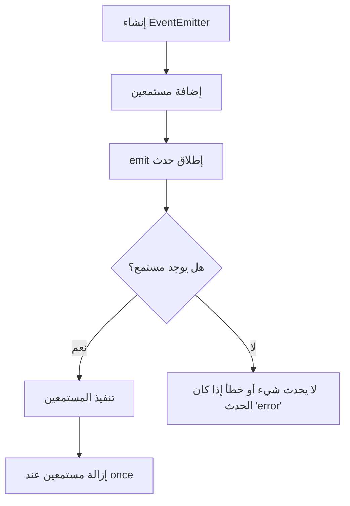

# events (إدارة الأحداث في Node.js)

---

## الوصف
موديول `events` يوفر واجهة لإنشاء وإدارة الأحداث (EventEmitter)، وهو أساس نظام الأحداث في Node.js. يُستخدم في بناء تطبيقات تعتمد على الأحداث مثل الخوادم، التعامل مع البيانات المتدفقة، والتكامل مع مكتبات الطرف الثالث.

---

## فهرس الكلاسات والدوال (جدول سريع)
| الكلاس/الدالة | الوصف | متوافق منذ |
|---------------|-------|------------|
| [`EventEmitter`](#eventemitter) | الكلاس الأساسي لإدارة الأحداث | دائمًا |
| [`on`](#on) | إضافة مستمع لحدث | دائمًا |
| [`once`](#once) | مستمع لمرة واحدة | دائمًا |
| [`emit`](#emit) | إطلاق حدث | دائمًا |
| [`removeListener`/`off`](#removelisteneroff) | إزالة مستمع | دائمًا |
| [`removeAllListeners`](#removealllisteners) | إزالة جميع المستمعين | دائمًا |
| [`listeners`](#listeners) | جلب جميع المستمعين | دائمًا |
| [`eventNames`](#eventnames) | جلب جميع أسماء الأحداث | v6.0.0 |
| [`setMaxListeners`](#setmaxlisteners) | تحديد الحد الأقصى للمستمعين | دائمًا |
| [`getMaxListeners`](#getmaxlisteners) | جلب الحد الأقصى الحالي | دائمًا |
| [`rawListeners`](#rawlisteners) | جلب المستمعين الأصليين | v9.4.0 |
| [`prependListener`](#prependlistener) | إضافة مستمع في البداية | v6.0.0 |
| [`prependOnceListener`](#prependoncelistener) | مستمع لمرة واحدة في البداية | v6.0.0 |
| [`listenerCount`](#listenercount) | عدد المستمعين لحدث | دائمًا |
| [`captureRejections`](#capturerejections) | التقاط الوعود المرفوضة | v13.4.0 |

---

## مخطط مرئي (Mermaid) لتدفق الأحداث


---

## شرح الكلاسات والدوال الأساسية والموسعة

### EventEmitter
- **الوصف**: الكلاس الأساسي لإنشاء كائنات تدعم الأحداث.
- **مثال:**
```js
const EventEmitter = require('events');
const emitter = new EventEmitter();
```

---

### on(event, listener)
- **event**: اسم الحدث (String)
- **listener**: دالة تُنفذ عند إطلاق الحدث
- **الوصف**: إضافة مستمع دائم لحدث معين.
- **مثال:**
```js
emitter.on('data', (msg) => console.log('وصلت رسالة:', msg));
```

---

### once(event, listener)
- **event**: اسم الحدث
- **listener**: دالة تُنفذ مرة واحدة فقط
- **الوصف**: إضافة مستمع يُنفذ لمرة واحدة فقط عند إطلاق الحدث.
- **مثال:**
```js
emitter.once('init', () => console.log('تهيئة لمرة واحدة'));
emitter.emit('init');
```

---

### emit(event, ...args)
- **event**: اسم الحدث
- **...args**: بيانات إضافية تُمرر للمستمعين
- **الوصف**: إطلاق حدث وتنفيذ جميع المستمعين المسجلين له.
- **مثال:**
```js
emitter.emit('data', 'مرحبا بالعالم');
```

---

### removeListener(event, listener) / off(event, listener)
- **event**: اسم الحدث
- **listener**: الدالة المراد إزالتها
- **الوصف**: إزالة مستمع معين من حدث.
- **مثال:**
```js
function handler() { console.log('تم الحذف'); }
emitter.on('remove', handler);
emitter.off('remove', handler);
```

---

### removeAllListeners([event])
- **event**: اسم الحدث (اختياري)
- **الوصف**: إزالة جميع المستمعين لحدث معين أو لكل الأحداث.
- **مثال:**
```js
emitter.removeAllListeners('data');
```

---

### listeners(event)
- **event**: اسم الحدث
- **الوصف**: جلب جميع المستمعين لحدث معين.
- **مثال:**
```js
console.log(emitter.listeners('data'));
```

---

### eventNames()
- **الوصف**: جلب جميع أسماء الأحداث المسجلة.
- **مثال:**
```js
console.log(emitter.eventNames());
```

---

### setMaxListeners(n)
- **n**: عدد صحيح (Integer) للحد الأقصى للمستمعين
- **الوصف**: تحديد الحد الأقصى لعدد المستمعين لكل حدث.
- **مثال:**
```js
emitter.setMaxListeners(20);
```

---

### getMaxListeners()
- **الوصف**: جلب الحد الأقصى الحالي للمستمعين.
- **مثال:**
```js
console.log(emitter.getMaxListeners());
```

---

### rawListeners(event)
- **الوصف**: جلب المستمعين الأصليين (بما فيهم once قبل التنفيذ).
- **مثال:**
```js
console.log(emitter.rawListeners('data'));
```

---

### prependListener(event, listener)
- **الوصف**: إضافة مستمع في بداية قائمة المستمعين.
- **مثال:**
```js
emitter.prependListener('data', () => console.log('أول مستمع'));
```

---

### prependOnceListener(event, listener)
- **الوصف**: مستمع لمرة واحدة في البداية.
- **مثال:**
```js
emitter.prependOnceListener('data', () => console.log('أول مرة فقط'));
```

---

### listenerCount(event)
- **الوصف**: عدد المستمعين لحدث معين.
- **مثال:**
```js
console.log(emitter.listenerCount('data'));
```

---

### captureRejections
- **الوصف**: خاصية لتفعيل التقاط الوعود المرفوضة تلقائيًا في المستمعين async.
- **مثال:**
```js
const emitter = new EventEmitter({ captureRejections: true });
emitter.on('event', async () => { throw new Error('رفض!'); });
emitter.on('error', err => console.error('تم التقاط:', err));
```

---

## مقارنة بين بعض الدوال المتشابهة
| الدالة | متى تستخدمها؟ |
|--------|---------------|
| `on` | لإضافة مستمع دائم |
| `once` | لإضافة مستمع لمرة واحدة |
| `prependListener` | لإضافة مستمع في البداية |
| `removeListener`/`off` | لإزالة مستمع معين |
| `removeAllListeners` | لإزالة جميع المستمعين |

---

## حالات الاستخدام الشائعة
- بناء أنظمة إشعارات أو مراقبة
- التعامل مع تدفقات البيانات (stream)
- إدارة الأحداث في الخوادم أو تطبيقات الويب
- التكامل مع مكتبات تعتمد الأحداث

---

## أفضل الممارسات
- راقب عدد المستمعين واستخدم setMaxListeners عند الحاجة
- أضف دائمًا مستمع لحدث 'error' لتجنب انهيار التطبيق
- أزل المستمعين غير الضروريين لتقليل استهلاك الذاكرة
- استخدم once للأحداث التي تحدث مرة واحدة فقط
- تعامل مع الأخطاء في جميع المستمعين

---

## التحذيرات الأمنية
- لا تعتمد على الأحداث لنقل بيانات حساسة بين أجزاء غير موثوقة
- تعامل مع الأخطاء دائمًا في مستمع 'error'
- لا تترك مستمعين غير ضروريين لتجنب تسرب الذاكرة

---

## أدوات التصحيح المتعلقة
- [node --inspect](https://nodejs.org/en/docs/guides/debugging-getting-started/)
- [eventemitter3](https://www.npmjs.com/package/eventemitter3) (بديل خفيف وسريع)
- [why-is-node-running](https://www.npmjs.com/package/why-is-node-running)

---

## توافق الإصدارات
- معظم الدوال الأساسية متوفرة منذ الإصدارات الأولى
- خصائص مثل rawListeners, captureRejections متوفرة في الإصدارات الحديثة فقط
- راجع [توثيق Node.js الرسمي - events](https://nodejs.org/docs/latest/api/events.html) لأي تحديثات

---

## اختبار تفاعلي
```js
const test = require('node:test');
const assert = require('node:assert');
const EventEmitter = require('events');

test('اختبار on/emit', () => {
  const emitter = new EventEmitter();
  let result = '';
  emitter.on('msg', (txt) => { result = txt; });
  emitter.emit('msg', 'ok');
  assert.strictEqual(result, 'ok');
});

test('اختبار once', () => {
  const emitter = new EventEmitter();
  let count = 0;
  emitter.once('inc', () => { count++; });
  emitter.emit('inc');
  emitter.emit('inc');
  assert.strictEqual(count, 1);
});
```

---

## نصائح الخبراء
- راقب عدد المستمعين لتجنب تسرب الذاكرة
- استخدم once للأحداث التي تحدث مرة واحدة فقط
- استخدم eventNames و listeners لمراقبة حالة الأحداث
- تعامل مع الأخطاء في جميع المستمعين

---

## ملاحظات تقنية
- معظم مكتبات Node.js (مثل http, stream) ترث من EventEmitter
- إطلاق الأحداث (emit) سريع جدًا لكن المستمعين الكُثر قد يؤثرون على الأداء
- راجع [توثيق Node.js الرسمي - events](https://nodejs.org/docs/latest/api/events.html) لأي تحديثات 

---

## أمثلة شاملة متقدمة

### مثال 1: بناء نظام إشعارات بسيط باستخدام EventEmitter
```js
const EventEmitter = require('events');
class Notifier extends EventEmitter {
  notify(msg) {
    this.emit('notify', msg);
  }
}
const notifier = new Notifier();
notifier.on('notify', msg => {
  console.log('إشعار جديد:', msg);
});
notifier.notify('تمت إضافة عنصر جديد!');
```
**شرح:** يوضح كيفية بناء نظام إشعارات بسيط عبر الأحداث.

---

### مثال 2: التعامل مع الأخطاء في الأحداث
```js
const EventEmitter = require('events');
const emitter = new EventEmitter();
emitter.on('error', err => {
  console.error('حدث خطأ:', err.message);
});
emitter.emit('error', new Error('فشل في العملية'));
```
**شرح:** يوضح أهمية التعامل مع حدث 'error' لتجنب انهيار التطبيق.

---

### مثال 3: استخدام once وprependListener مع الأحداث
```js
const EventEmitter = require('events');
const emitter = new EventEmitter();
emitter.once('init', () => console.log('تهيئة لمرة واحدة'));
emitter.prependListener('init', () => console.log('سيتم تنفيذ هذا أولاً'));
emitter.emit('init');
```
**شرح:** يوضح الفرق بين once وprependListener.

---

### مثال 4: عداد أحداث متقدم مع listenerCount
```js
const EventEmitter = require('events');
const emitter = new EventEmitter();
function handler() { console.log('تم التنفيذ'); }
emitter.on('data', handler);
console.log('عدد المستمعين:', emitter.listenerCount('data'));
emitter.off('data', handler);
console.log('عدد المستمعين بعد الإزالة:', emitter.listenerCount('data'));
```
**شرح:** يوضح كيفية عد المستمعين وإزالتهم ديناميكياً.

---

### مثال 5: التقاط الوعود المرفوضة تلقائياً
```js
const EventEmitter = require('events');
const emitter = new EventEmitter({ captureRejections: true });
emitter.on('event', async () => { throw new Error('رفض!'); });
emitter.on('error', err => console.error('تم التقاط:', err));
emitter.emit('event');
```
**شرح:** يوضح ميزة captureRejections في الأحداث غير المتزامنة.

--- 