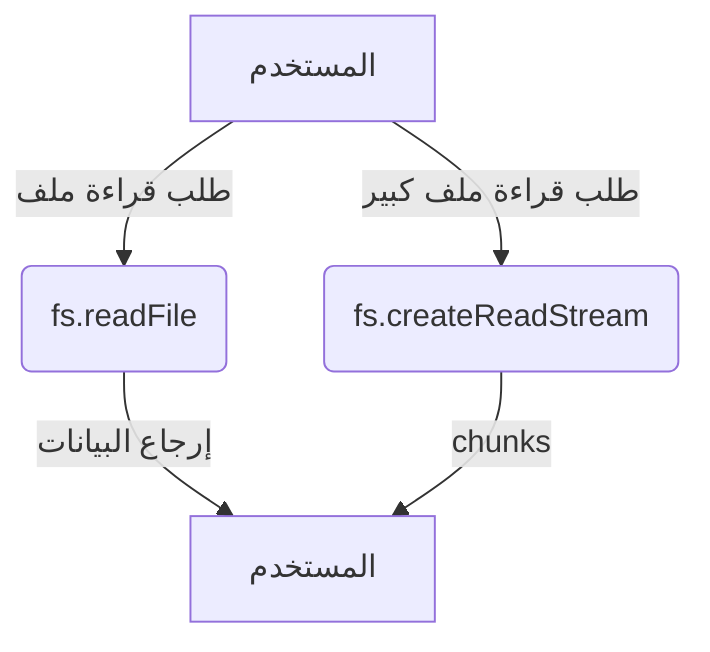

# fs (نظام الملفات)

## الوصف
واجهة Node.js للتعامل مع نظام الملفات (قراءة، كتابة، حذف، إدارة الملفات والمجلدات) وتدعم العمليات المتزامنة وغير المتزامنة عبر Callbacks وPromises. تُستخدم بكثرة في تطبيقات الخوادم لمعالجة الملفات النصية، الصور، السجلات.

---

## الدوال الأساسية

| الدالة                | المعاملات                | الوصف                        |
|-----------------------|--------------------------|------------------------------|
| `fs.readFile`         | path, options, callback  | قراءة ملف                    |
| `fs.writeFile`        | file, data, options      | كتابة ملف                    |
| `fs.appendFile`       | path, data, options      | إضافة بيانات لنهاية ملف      |
| `fs.createReadStream` | path, options            | إنشاء Stream للقراءة         |
| `fs.createWriteStream`| path, options            | إنشاء Stream للكتابة         |
| `fs.stat`             | path, options, callback  | معلومات عن ملف/مجلد         |
| `fs.mkdir`            | path, options, callback  | إنشاء مجلد                   |
| `fs.rm`               | path, options, callback  | حذف ملف أو مجلد              |
| `fs.rename`           | oldPath, newPath, cb     | إعادة تسمية ملف/مجلد         |
| ...                   | ...                      | ...                          |

---

## مقارنة بين الدوال المتشابهة

| المعيار            | fs.readFile()      | fs.createReadStream() |
|--------------------|--------------------|-----------------------|
| حجم الملف المناسب  | < 100MB            | > 100MB               |
| استخدام الذاكرة    | عالي               | منخفض                 |
| الأداء             | أبطأ للملفات الكبيرة| أسرع للملفات الكبيرة  |
| أسلوب القراءة      | دفعة واحدة         | أجزاء (chunks)        |

---

## أمثلة عملية متقدمة

```js
// قراءة ملف كبير باستخدام Stream مع معالجة الأخطاء
const fs = require('fs');
const readStream = fs.createReadStream('bigfile.txt', { encoding: 'utf8' });
readStream.on('data', chunk => {
  console.log('جزء:', chunk.length);
});
readStream.on('error', err => {
  console.error('خطأ في القراءة:', err);
});
readStream.on('end', () => {
  console.log('انتهت القراءة.');
});
```

```js
// مثال متقدم: التعامل مع الأذونات وملفات حساسة
const fs = require('fs');
fs.access('secret.txt', fs.constants.R_OK, (err) => {
  if (err) {
    console.error('لا يمكن قراءة الملف (قد يكون محميًا):', err);
  } else {
    fs.readFile('secret.txt', 'utf8', (err, data) => {
      if (err) return console.error('خطأ في القراءة:', err);
      console.log('المحتوى:', data);
    });
  }
});
```

---

## حالات الاستخدام الشائعة
- قراءة وكتابة ملفات الإعدادات (JSON, TXT)
- حفظ سجلات الخادم (logs)
- رفع وتحميل الملفات في تطبيقات الويب
- معالجة الصور أو الملفات الثنائية
- مراقبة التغييرات على الملفات (watch)

---

## أفضل الممارسات
- استخدم الدوال غير المتزامنة (Async) في بيئة الخادم
- أغلق جميع file descriptors بعد الانتهاء
- استخدم Streams للملفات الكبيرة
- تحقق من صلاحيات الوصول قبل العمليات الحساسة
- استخدم try/catch مع الدوال المتزامنة
- استخدم fs.promises وAsync/Await للكود الحديث

---

## التحذيرات الأمنية
- لا تعرض مسارات أو محتوى الملفات الحساسة للمستخدم النهائي
- تحقق من مدخلات المستخدم قبل تمريرها لمسارات الملفات
- تجنب الكتابة فوق ملفات النظام أو ملفات التكوين الهامة
- راقب عدد الملفات المفتوحة لتجنب تسرب الموارد

---

## أدوات التصحيح المتعلقة
- [node-inspect](https://nodejs.org/en/docs/guides/debugging-getting-started/)
- [lsof](https://linux.die.net/man/8/lsof) (لمراقبة الملفات المفتوحة)
- [strace](https://linux.die.net/man/1/strace) (تتبع استدعاءات النظام)

---

## التوافق مع إصدارات Node.js
- معظم دوال fs مستقرة منذ الإصدارات الأولى
- بعض الدوال مثل fs.rm وfs.cp أضيفت في Node.js 14+
- راجع [توثيق Node.js](https://nodejs.org/docs/latest/api/fs.html) لأي تغييرات حديثة

---

## مخطط تدفق (Mermaid)


---

## اختبار تفاعلي
```js
const test = require('node:test');
const assert = require('node:assert');
const fs = require('fs');

test('اختبار كتابة وقراءة ملف', async (t) => {
  const file = 'test.txt';
  await fs.promises.writeFile(file, 'hello');
  const data = await fs.promises.readFile(file, 'utf8');
  assert.strictEqual(data, 'hello');
  await fs.promises.unlink(file);
});
```

---

## الأخطاء الشائعة
- [❌] نسيان إغلاق file descriptors → الحل: استخدم دائمًا fs.close أو fileHandle.close().
- [❌] عدم معالجة الأخطاء في callbacks → الحل: تحقق دائماً من وجود خطأ قبل معالجة النتيجة.
- [❌] استخدام الدوال المتزامنة في تطبيقات الخادم → الحل: استخدم الدوال غير المتزامنة دائماً في بيئة الإنتاج.
- [❌] عدم التحقق من صلاحيات الوصول → الحل: استخدم fs.access قبل العمليات الحساسة.

---

## نصائح الخبراء
- [💡] استخدم Promises أو Async/Await لكتابة كود أكثر وضوحاً وأقل عرضة للأخطاء.
- [⚠️] لا تعرض مسارات الملفات الحساسة للمستخدم النهائي.
- [🚀] استخدم Streams للملفات الكبيرة لتقليل استهلاك الذاكرة وتحسين الأداء.
- [💡] أغلق جميع file descriptors بعد الانتهاء لتجنب تسرب الذاكرة.
- [🚀] رتب العمليات المتسلسلة (مثل rename ثم stat) باستخدام await أو داخل callback لتجنب السباق.
- [⚠️] استخدم fs.access بدلاً من fs.exists للتحقق من صلاحيات الوصول.
- [💡] استخدم fs.promises للدوال الحديثة التي تدعم Promises بشكل أفضل.
- [🚀] استخدم highWaterMark في Streams لتحسين الأداء مع الملفات الكبيرة.
- [⚠️] تحقق من وجود الملف قبل العمليات الحساسة لتجنب الأخطاء.
- [💡] استخدم try-catch مع الدوال المتزامنة و error handling مع الدوال غير المتزامنة. 