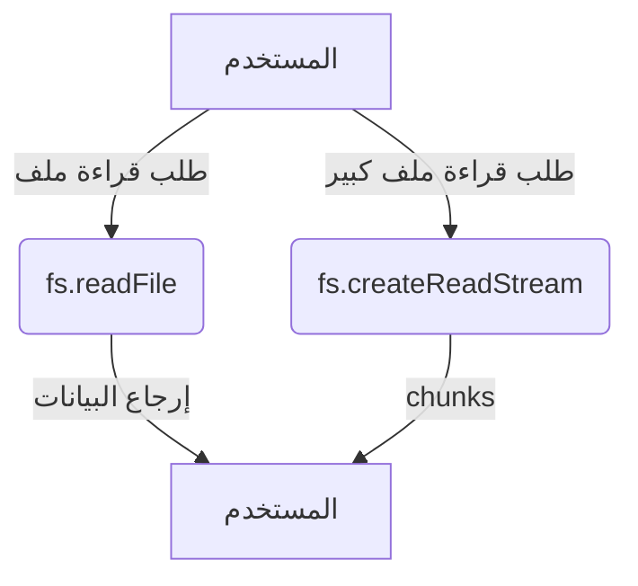

# fs (نظام الملفات في Node.js)

## الوصف
واجهة شاملة للتعامل مع الملفات والمجلدات والروابط في Node.js. تدعم العمليات المتزامنة (Sync) وغير المتزامنة (Callback/Promise)، وتوفر أدوات متقدمة لإدارة الملفات، المجلدات، الروابط، الأذونات، المراقبة، والعمليات منخفضة المستوى.

---

## فهرس شامل للدوال والكلاسات

### دوال الملفات
| الدالة | الوصف |
|--------|-------|
| [`fs.readFile`](#fsreadfilepath-options-callback) | قراءة ملف كامل |
| [`fs.writeFile`](#fswritefilefile-data-options-callback) | كتابة ملف كامل |
| [`fs.appendFile`](#fsappendfilepath-data-options-callback) | إضافة بيانات لنهاية ملف |
| [`fs.truncate`](#fstruncatepath-len-callback) | تقليص/توسيع ملف |
| [`fs.unlink`](#fsunlinkpath-callback) | حذف ملف |
| [`fs.copyFile`](#fscopyfilesrc-dest-flags-callback) | نسخ ملف |
| [`fs.rename`](#fsrenameoldpath-newpath-callback) | إعادة تسمية ملف/مجلد |
| [`fs.stat`](#fsstatpath-options-callback) | معلومات عن ملف/مجلد |
| [`fs.lstat`](#fslstatpath-options-callback) | معلومات عن رابط رمزي/ملف |
| [`fs.utimes`](#fsutimespath-atime-mtime-callback) | تحديث أوقات الوصول/التعديل |
| [`fs.access`](#fsaccesspath-mode-callback) | التحقق من صلاحيات الوصول |

### دوال المجلدات
| الدالة | الوصف |
|--------|-------|
| [`fs.mkdir`](#fsmkdirpath-options-callback) | إنشاء مجلد |
| [`fs.rmdir`](#fsrmdirpath-options-callback) | حذف مجلد (قديم) |
| [`fs.rm`](#fsrmpath-options-callback) | حذف ملف أو مجلد |
| [`fs.readdir`](#fsreaddirpath-options-callback) | قراءة محتويات مجلد |

### دوال الروابط
| الدالة | الوصف |
|--------|-------|
| [`fs.symlink`](#fssymlinktarget-path-type-callback) | إنشاء رابط رمزي |
| [`fs.readlink`](#fsreadlinkpath-options-callback) | قراءة هدف رابط رمزي |

### دوال منخفضة المستوى
| الدالة | الوصف |
|--------|-------|
| [`fs.open`](#fsopenpath-flags-mode-callback) | فتح ملف (File Descriptor) |
| [`fs.close`](#fsclosefd-callback) | إغلاق ملف |
| [`fs.read`](#fsreadfd-buffer-offset-length-position-callback) | قراءة من ملف مفتوح |
| [`fs.write`](#fswritefd-buffer-offset-length-position-callback) | كتابة في ملف مفتوح |

### دوال Streams
| الدالة | الوصف |
|--------|-------|
| [`fs.createReadStream`](#fscreatereadstreampath-options) | إنشاء Stream للقراءة |
| [`fs.createWriteStream`](#fscreatewritestreampath-options) | إنشاء Stream للكتابة |

### دوال Promises
| الدالة | الوصف |
|--------|-------|
| [`fs.promises.readFile`](#fspromisesreadfilepath-options) | قراءة ملف (Promise) |
| [`fs.promises.writeFile`](#fspromiseswritefilefile-data-options) | كتابة ملف (Promise) |
| ... | ... |

### الكلاسات المهمة
| الكلاس | الوصف |
|--------|-------|
| [`fs.Stats`](#fsstats) | معلومات مفصلة عن ملف/مجلد |
| [`fs.Dir`](#fsdir) | التعامل مع مجلدات بشكل متقدم |
| [`fs.Dirent`](#fsdirent) | معلومات عن عنصر داخل مجلد |
| [`fs.FSWatcher`](#fsfswatcher) | مراقبة التغييرات على الملفات/المجلدات |
| [`fs.WriteStream`](#fswritestream) | Stream للكتابة |
| [`fs.ReadStream`](#fsreadstream) | Stream للقراءة |

---

## شرح الدوال والكلاسات الأساسية (أمثلة وبارامترات)

### fs.readFile(path[, options], callback)
- **path**: مسار الملف (String | Buffer | URL)
- **options**: الترميز أو كائن خيارات (اختياري)
- **callback**: function(err, data)
- **الوصف**: قراءة ملف كامل في الذاكرة.
- **مثال:**
```js
fs.readFile('file.txt', 'utf8', (err, data) => {
  if (err) throw err;
  console.log(data);
});
```
[توثيق رسمي](https://nodejs.org/docs/latest/api/fs.html#fsreadfilepath-options-callback)

---

### fs.writeFile(file, data[, options], callback)
- **file**: مسار الملف أو File Descriptor
- **data**: البيانات (String | Buffer | TypedArray | DataView)
- **options**: الترميز أو كائن خيارات (اختياري)
- **callback**: function(err)
- **الوصف**: كتابة بيانات إلى ملف (يُنشئ أو يستبدل الملف).
- **مثال:**
```js
fs.writeFile('file.txt', 'Hello World', (err) => {
  if (err) throw err;
  console.log('تمت الكتابة!');
});
```
[توثيق رسمي](https://nodejs.org/docs/latest/api/fs.html#fswritefilefile-data-options-callback)

---

### fs.appendFile(path, data[, options], callback)
- **path**: مسار الملف أو File Descriptor
- **data**: البيانات (String | Buffer | TypedArray | DataView)
- **options**: الترميز أو كائن خيارات (اختياري)
- **callback**: function(err)
- **الوصف**: إضافة بيانات لنهاية ملف (ينشئ الملف إذا لم يوجد).
- **مثال:**
```js
fs.appendFile('log.txt', 'سطر جديد\n', (err) => {
  if (err) throw err;
});
```
[توثيق رسمي](https://nodejs.org/docs/latest/api/fs.html#fsappendfilepath-data-options-callback)

---

### fs.truncate(path[, len], callback)
- **path**: مسار الملف (String | Buffer | URL)
- **len**: الطول الجديد (Number, اختياري)
- **callback**: function(err)
- **الوصف**: تقليص أو توسيع حجم الملف لطول محدد (افتراضي 0).
- **مثال:**
```js
fs.truncate('file.txt', 10, (err) => {
  if (err) throw err;
  console.log('تم تقليص الملف إلى 10 بايت');
});
```
[توثيق رسمي](https://nodejs.org/docs/latest/api/fs.html#fstruncatepath-len-callback)

---

### fs.unlink(path, callback)
- **path**: مسار الملف (String | Buffer | URL)
- **callback**: function(err)
- **الوصف**: حذف ملف (لا يعمل على المجلدات).
- **مثال:**
```js
fs.unlink('file.txt', (err) => {
  if (err) throw err;
  console.log('تم حذف الملف!');
});
```
[توثيق رسمي](https://nodejs.org/docs/latest/api/fs.html#fsunlinkpath-callback)

---

### fs.copyFile(src, dest[, flags], callback)
- **src**: مسار الملف المصدر (String | Buffer | URL)
- **dest**: مسار الملف الهدف (String | Buffer | URL)
- **flags**: خيارات النسخ (Number, اختياري)
- **callback**: function(err)
- **الوصف**: نسخ ملف من src إلى dest مع خيارات إضافية (مثل عدم الكتابة فوق الملف الهدف).
- **مثال:**
```js
fs.copyFile('source.txt', 'dest.txt', fs.constants.COPYFILE_EXCL, (err) => {
  if (err) throw err;
  console.log('تم النسخ بنجاح!');
});
```
[توثيق رسمي](https://nodejs.org/docs/latest/api/fs.html#fscopyfilesrc-dest-flags-callback)

---

### fs.rename(oldPath, newPath, callback)
- **oldPath**: المسار القديم (String | Buffer | URL)
- **newPath**: المسار الجديد (String | Buffer | URL)
- **callback**: function(err)
- **الوصف**: إعادة تسمية ملف أو مجلد.
- **مثال:**
```js
fs.rename('old.txt', 'new.txt', (err) => {
  if (err) throw err;
  console.log('تمت إعادة التسمية!');
});
```
[توثيق رسمي](https://nodejs.org/docs/latest/api/fs.html#fsrenameoldpath-newpath-callback)

---

### fs.stat(path[, options], callback)
- **path**: المسار (String | Buffer | URL)
- **options**: خيارات (Object, اختياري)
- **callback**: function(err, stats)
- **الوصف**: معلومات عن ملف أو مجلد (حجم، أذونات، أوقات...)
- **مثال:**
```js
fs.stat('file.txt', (err, stats) => {
  if (err) throw err;
  console.log('الحجم:', stats.size);
});
```
[توثيق رسمي](https://nodejs.org/docs/latest/api/fs.html#fsstatpath-options-callback)

---

### fs.lstat(path[, options], callback)
- **الوصف**: مثل stat لكن إذا كان المسار رابط رمزي يرجع معلومات الرابط نفسه وليس الهدف.
- **مثال:**
```js
fs.lstat('symlink', (err, stats) => {
  if (err) throw err;
  console.log('هل هو رابط رمزي؟', stats.isSymbolicLink());
});
```
[توثيق رسمي](https://nodejs.org/docs/latest/api/fs.html#fslstatpath-options-callback)

---

### fs.utimes(path, atime, mtime, callback)
- **الوصف**: تحديث أوقات الوصول والتعديل لملف أو مجلد.
- **مثال:**
```js
fs.utimes('file.txt', new Date(), new Date(), (err) => {
  if (err) throw err;
  console.log('تم تحديث الأوقات');
});
```
[توثيق رسمي](https://nodejs.org/docs/latest/api/fs.html#fsutimespath-atime-mtime-callback)

---

### fs.access(path[, mode], callback)
- **الوصف**: التحقق من وجود الملف وصلاحيات الوصول (قراءة/كتابة/تنفيذ).
- **مثال:**
```js
fs.access('file.txt', fs.constants.R_OK | fs.constants.W_OK, (err) => {
  if (err) {
    console.error('لا يمكن القراءة أو الكتابة');
  } else {
    console.log('الملف قابل للقراءة والكتابة');
  }
});
```
[توثيق رسمي](https://nodejs.org/docs/latest/api/fs.html#fsaccesspath-mode-callback)

---

### fs.mkdir(path[, options], callback)
- **الوصف**: إنشاء مجلد جديد.
- **مثال:**
```js
fs.mkdir('newdir', { recursive: true }, (err) => {
  if (err) throw err;
  console.log('تم إنشاء المجلد!');
});
```
[توثيق رسمي](https://nodejs.org/docs/latest/api/fs.html#fsmkdirpath-options-callback)

---

### fs.rm(path[, options], callback)
- **الوصف**: حذف ملف أو مجلد (يدعم الحذف العميق).
- **مثال:**
```js
fs.rm('dir', { recursive: true, force: true }, (err) => {
  if (err) throw err;
  console.log('تم الحذف!');
});
```
[توثيق رسمي](https://nodejs.org/docs/latest/api/fs.html#fsrmpath-options-callback)

---

### fs.readdir(path[, options], callback)
- **الوصف**: قراءة محتويات مجلد (ترجع أسماء الملفات/المجلدات أو كائنات Dirent).
- **مثال:**
```js
fs.readdir('.', { withFileTypes: true }, (err, files) => {
  if (err) throw err;
  files.forEach(dirent => {
    console.log(dirent.name, dirent.isDirectory() ? 'مجلد' : 'ملف');
  });
});
```
[توثيق رسمي](https://nodejs.org/docs/latest/api/fs.html#fsreaddirpath-options-callback)

---

### fs.symlink(target, path[, type], callback)
- **الوصف**: إنشاء رابط رمزي جديد يشير إلى target.
- **مثال:**
```js
fs.symlink('target.txt', 'link.txt', 'file', (err) => {
  if (err) throw err;
  console.log('تم إنشاء الرابط الرمزي!');
});
```
[توثيق رسمي](https://nodejs.org/docs/latest/api/fs.html#fssymlinktarget-path-type-callback)

---

### fs.readlink(path[, options], callback)
- **الوصف**: قراءة هدف الرابط الرمزي (يرجع المسار الذي يشير إليه الرابط).
- **مثال:**
```js
fs.readlink('mysymlink', (err, linkString) => {
  if (err) throw err;
  console.log('الرابط يشير إلى:', linkString);
});
```
[توثيق رسمي](https://nodejs.org/docs/latest/api/fs.html#fsreadlinkpath-options-callback)

---

### fs.createReadStream(path[, options])
- **الوصف**: إنشاء Stream للقراءة من ملف كبير أو تدفق بيانات.
- **مثال:**
```js
const stream = fs.createReadStream('bigfile.txt', { encoding: 'utf8' });
stream.on('data', chunk => console.log('جزء:', chunk.length));
stream.on('end', () => console.log('انتهت القراءة.'));
```
[توثيق رسمي](https://nodejs.org/docs/latest/api/fs.html#fscreatereadstreampath-options)

---

### fs.createWriteStream(path[, options])
- **الوصف**: إنشاء Stream للكتابة إلى ملف كبير أو تدفق بيانات.
- **مثال:**
```js
const stream = fs.createWriteStream('output.txt');
stream.write('سطر أول\n');
stream.end('النهاية');
```
[توثيق رسمي](https://nodejs.org/docs/latest/api/fs.html#fscreatewritestreampath-options)

---

## شرح الكلاسات المهمة

### fs.Stats
- **الوصف**: كائن يحتوي معلومات مفصلة عن ملف أو مجلد (حجم، أذونات، أوقات، نوع).
- **أهم الدوال:**
  - `isFile()`, `isDirectory()`, `isSymbolicLink()`, ...
- **مثال:**
```js
fs.stat('file.txt', (err, stats) => {
  if (err) throw err;
  if (stats.isFile()) console.log('ملف');
  if (stats.isDirectory()) console.log('مجلد');
});
```
[توثيق رسمي](https://nodejs.org/docs/latest/api/fs.html#class-fsstats)

---

### fs.Dir, fs.Dirent
- **الوصف**: التعامل مع المجلدات وقراءة محتوياتها بشكل متقدم (مع معرفة نوع كل عنصر).
- **مثال:**
```js
fs.readdir('.', { withFileTypes: true }, (err, files) => {
  files.forEach(dirent => {
    if (dirent.isDirectory()) console.log('مجلد:', dirent.name);
    if (dirent.isFile()) console.log('ملف:', dirent.name);
  });
});
```
[توثيق رسمي](https://nodejs.org/docs/latest/api/fs.html#class-fsdirent)

---

### fs.FSWatcher
- **الوصف**: مراقبة التغييرات على الملفات أو المجلدات (إضافة/تعديل/حذف).
- **مثال:**
```js
const watcher = fs.watch('file.txt', (eventType, filename) => {
  console.log('حدث:', eventType, filename);
});
```
[توثيق رسمي](https://nodejs.org/docs/latest/api/fs.html#class-fswatcher)

---

### fs.WriteStream, fs.ReadStream
- **الوصف**: Streams للكتابة/القراءة من الملفات الكبيرة أو تدفقات البيانات.
- **مثال:**
```js
const ws = fs.createWriteStream('out.txt');
ws.write('بيانات');
ws.end();
```
[توثيق رسمي](https://nodejs.org/docs/latest/api/fs.html#fswritestream)

---

## مقارنة بين الدوال المتشابهة

| المعيار            | fs.readFile()      | fs.createReadStream() |
|--------------------|--------------------|-----------------------|
| حجم الملف المناسب  | < 100MB            | > 100MB               |
| استخدام الذاكرة    | عالي               | منخفض                 |
| الأداء             | أبطأ للملفات الكبيرة| أسرع للملفات الكبيرة  |
| أسلوب القراءة      | دفعة واحدة         | أجزاء (chunks)        |

---

## التعامل مع المسارات (String/Buffer/URL)
- معظم دوال fs تدعم المسارات كـ String أو Buffer أو كائن URL (file:).
- المسارات النسبية تُفسر نسبةً إلى process.cwd().
- مثال:
```js
fs.readFileSync(new URL('file:///tmp/hello'));
```

---

## إدارة file descriptors
- عند استخدام fs.open/fs.close يجب إغلاق كل ملف بعد الانتهاء لتجنب تسرب الموارد.
- مثال:
```js
fs.open('file.txt', 'r', (err, fd) => {
  if (err) throw err;
  fs.close(fd, (err) => {
    if (err) throw err;
  });
});
```
- مع fs.promises:
```js
const { open } = require('fs/promises');
let file;
try {
  file = await open('file.txt', 'r');
  // ...
} finally {
  await file.close();
}
```

---

## ملاحظات حول الأداء (threadpool)
- جميع دوال fs غير المتزامنة (عدا FSWatcher) تستخدم threadpool.
- يمكن ضبط حجم threadpool عبر UV_THREADPOOL_SIZE.

---

## fs.constants وأهم القيم
- F_OK, R_OK, W_OK, X_OK: للتحقق من وجود/قراءة/كتابة/تنفيذ ملف.
- COPYFILE_EXCL: لمنع الكتابة فوق الملف الهدف في copyFile.
- مثال:
```js
fs.access('file.txt', fs.constants.R_OK | fs.constants.W_OK, (err) => { ... });
```

---

## أمثلة عملية متقدمة

### قراءة ملف كبير باستخدام Stream مع معالجة الأخطاء
```js
const readStream = fs.createReadStream('bigfile.txt', { encoding: 'utf8' });
readStream.on('data', chunk => {
  console.log('جزء:', chunk.length);
});
readStream.on('error', err => {
  console.error('خطأ في القراءة:', err);
});
readStream.on('end', () => {
  console.log('انتهت القراءة.');
});
```

### التعامل مع الأذونات وملفات حساسة
```js
fs.access('secret.txt', fs.constants.R_OK, (err) => {
  if (err) {
    console.error('لا يمكن قراءة الملف (قد يكون محميًا):', err);
  } else {
    fs.readFile('secret.txt', 'utf8', (err, data) => {
      if (err) return console.error('خطأ في القراءة:', err);
      console.log('المحتوى:', data);
    });
  }
});
```

---

## حالات الاستخدام الشائعة
- قراءة وكتابة ملفات الإعدادات (JSON, TXT)
- حفظ سجلات الخادم (logs)
- رفع وتحميل الملفات في تطبيقات الويب
- معالجة الصور أو الملفات الثنائية
- مراقبة التغييرات على الملفات (watch)

---

## أفضل الممارسات
- استخدم الدوال غير المتزامنة (Async) في بيئة الخادم
- أغلق جميع file descriptors بعد الانتهاء
- استخدم Streams للملفات الكبيرة
- تحقق من صلاحيات الوصول قبل العمليات الحساسة
- استخدم try/catch مع الدوال المتزامنة
- استخدم fs.promises وAsync/Await للكود الحديث

---

## التحذيرات الأمنية
- لا تعرض مسارات أو محتوى الملفات الحساسة للمستخدم النهائي
- تحقق من مدخلات المستخدم قبل تمريرها لمسارات الملفات
- تجنب الكتابة فوق ملفات النظام أو ملفات التكوين الهامة
- راقب عدد الملفات المفتوحة لتجنب تسرب الموارد

---

## أدوات التصحيح المتعلقة
- [node-inspect](https://nodejs.org/en/docs/guides/debugging-getting-started/)
- [lsof](https://linux.die.net/man/8/lsof) (لمراقبة الملفات المفتوحة)
- [strace](https://linux.die.net/man/1/strace) (تتبع استدعاءات النظام)

---

## التوافق مع إصدارات Node.js
- معظم دوال fs مستقرة منذ الإصدارات الأولى
- بعض الدوال مثل fs.rm وfs.cp أضيفت في Node.js 14+
- راجع [توثيق Node.js](https://nodejs.org/docs/latest/api/fs.html) لأي تغييرات حديثة

---

## مخطط تدفق (Mermaid)


---

## اختبار تفاعلي
```js
const test = require('node:test');
const assert = require('node:assert');
const fs = require('fs');

test('اختبار كتابة وقراءة ملف', async (t) => {
  const file = 'test.txt';
  await fs.promises.writeFile(file, 'hello');
  const data = await fs.promises.readFile(file, 'utf8');
  assert.strictEqual(data, 'hello');
  await fs.promises.unlink(file);
});
```

---

## الأخطاء الشائعة
- [❌] نسيان إغلاق file descriptors → الحل: استخدم دائمًا fs.close أو fileHandle.close().
- [❌] عدم معالجة الأخطاء في callbacks → الحل: تحقق دائماً من وجود خطأ قبل معالجة النتيجة.
- [❌] استخدام الدوال المتزامنة في تطبيقات الخادم → الحل: استخدم الدوال غير المتزامنة دائماً في بيئة الإنتاج.
- [❌] عدم التحقق من صلاحيات الوصول → الحل: استخدم fs.access قبل العمليات الحساسة.

---

## نصائح الخبراء
- [💡] استخدم Promises أو Async/Await لكتابة كود أكثر وضوحاً وأقل عرضة للأخطاء.
- [⚠️] لا تعرض مسارات الملفات الحساسة للمستخدم النهائي.
- [🚀] استخدم Streams للملفات الكبيرة لتقليل استهلاك الذاكرة وتحسين الأداء.
- [💡] أغلق جميع file descriptors بعد الانتهاء لتجنب تسرب الذاكرة.
- [🚀] رتب العمليات المتسلسلة (مثل rename ثم stat) باستخدام await أو داخل callback لتجنب السباق.
- [⚠️] استخدم fs.access بدلاً من fs.exists للتحقق من صلاحيات الوصول.
- [💡] استخدم fs.promises للدوال الحديثة التي تدعم Promises بشكل أفضل.
- [🚀] استخدم highWaterMark في Streams لتحسين الأداء مع الملفات الكبيرة.
- [⚠️] تحقق من وجود الملف قبل العمليات الحساسة لتجنب الأخطاء.
- [💡] استخدم try-catch مع الدوال المتزامنة و error handling مع الدوال غير المتزامنة. 

---

## أمثلة شاملة متقدمة

### مثال 1: نسخ مجلد كامل مع جميع الملفات والمجلدات الفرعية (Recursive Copy)
```js
const fs = require('fs');
const path = require('path');
function copyDir(src, dest) {
  fs.mkdir(dest, { recursive: true }, (err) => {
    if (err) return console.error('خطأ في إنشاء المجلد:', err);
    fs.readdir(src, { withFileTypes: true }, (err, entries) => {
      if (err) return console.error('خطأ في قراءة المجلد:', err);
      entries.forEach(entry => {
        const srcPath = path.join(src, entry.name);
        const destPath = path.join(dest, entry.name);
        if (entry.isDirectory()) {
          copyDir(srcPath, destPath);
        } else {
          fs.copyFile(srcPath, destPath, err => {
            if (err) console.error('خطأ في النسخ:', err);
          });
        }
      });
    });
  });
}
copyDir('source_folder', 'dest_folder');
```
**شرح:** يوضح كيفية نسخ مجلد كامل بشكل متداخل مع معالجة الأخطاء.

---

### مثال 2: مراقبة التغييرات على ملف وتسجيلها في سجل
```js
const fs = require('fs');
const watcher = fs.watch('watched.txt', (eventType, filename) => {
  fs.appendFile('log.txt', `حدث: ${eventType} على ${filename}\n`, err => {
    if (err) console.error('خطأ في السجل:', err);
  });
});
console.log('يتم الآن مراقبة watched.txt');
```
**شرح:** يوضح كيفية مراقبة ملف وتسجيل الأحداث في سجل.

---

### مثال 3: قراءة ملف كبير وتحويله إلى JSON مع معالجة الأخطاء
```js
const fs = require('fs');
fs.readFile('data.json', 'utf8', (err, data) => {
  if (err) return console.error('خطأ في القراءة:', err);
  try {
    const obj = JSON.parse(data);
    console.log('تم التحويل إلى كائن:', obj);
  } catch (e) {
    console.error('خطأ في التحويل إلى JSON:', e);
  }
});
```
**شرح:** يوضح كيفية قراءة ملف وتحويله إلى كائن مع معالجة جميع الأخطاء.

---

### مثال 4: استخدام fs.promises مع async/await لإدارة الملفات
```js
const fs = require('fs/promises');
async function safeMove(src, dest) {
  try {
    await fs.rename(src, dest);
    console.log('تم النقل بنجاح!');
  } catch (err) {
    if (err.code === 'EXDEV') {
      // إذا كان النقل بين أقراص مختلفة، انسخ ثم احذف
      await fs.copyFile(src, dest);
      await fs.unlink(src);
      console.log('تم النسخ والحذف (نقل بين أقراص)!');
    } else {
      console.error('خطأ في النقل:', err);
    }
  }
}
safeMove('file1.txt', 'folder/file1.txt');
```
**شرح:** يوضح كيفية التعامل مع النقل الآمن للملفات بين أقراص مختلفة.

---

### مثال 5: التعامل مع الملفات المؤقتة وتنظيفها تلقائياً
```js
const fs = require('fs');
const os = require('os');
const path = require('path');
const tmpFile = path.join(os.tmpdir(), `tmp_${Date.now()}.txt`);
fs.writeFile(tmpFile, 'بيانات مؤقتة', (err) => {
  if (err) return console.error('خطأ في الكتابة:', err);
  console.log('تم إنشاء ملف مؤقت:', tmpFile);
  setTimeout(() => {
    fs.unlink(tmpFile, (err) => {
      if (err) return console.error('خطأ في الحذف:', err);
      console.log('تم حذف الملف المؤقت!');
    });
  }, 5000);
});
```
**شرح:** يوضح كيفية إنشاء ملف مؤقت وحذفه تلقائياً بعد فترة.

--- 