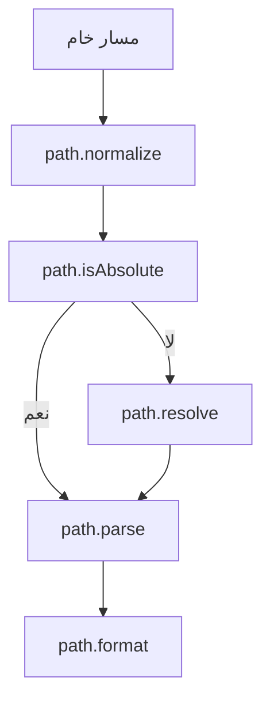

# path (معالجة المسارات في Node.js)

---

## الوصف

يوفر موديول `path` أدوات قوية للتعامل مع مسارات الملفات والمجلدات بشكل متوافق مع جميع أنظمة التشغيل (Windows, POSIX). يُستخدم في بناء تطبيقات تتعامل مع الملفات، توليد المسارات الديناميكية، والتحقق من صحة المسارات.

---

## فهرس الدوال (جدول سريع)

| الدالة                                                  | الوصف                            | متوافق منذ |
| ------------------------------------------------------- | -------------------------------- | ---------- |
| [`path.basename`](#pathbasenamepath-suffix)             | اسم الملف بدون المسار            | دائمًا     |
| [`path.dirname`](#pathdirnamepath)                      | اسم المجلد الحاوي                | دائمًا     |
| [`path.extname`](#pathextnamepath)                      | امتداد الملف                     | دائمًا     |
| [`path.join`](#pathjoinpaths)                           | دمج أجزاء لمسار                  | دائمًا     |
| [`path.resolve`](#pathresolvepaths)                     | تحويل أجزاء لمسار مطلق           | دائمًا     |
| [`path.isAbsolute`](#pathisabsolutepath)                | هل المسار مطلق؟                  | دائمًا     |
| [`path.normalize`](#pathnormalizepath)                  | تصحيح المسار                     | دائمًا     |
| [`path.parse`](#pathparsepath)                          | تحليل المسار لكائن               | دائمًا     |
| [`path.format`](#pathformatpathobject)                  | بناء مسار من كائن                | دائمًا     |
| [`path.relative`](#pathrelativerfrom-to)                | حساب المسار النسبي               | دائمًا     |
| [`path.sep`](#pathsep)                                  | فاصل المسارات                    | دائمًا     |
| [`path.delimiter`](#pathdelimiter)                      | فاصل متغيرات البيئة              | دائمًا     |
| [`path.win32`](#pathwin32) / [`path.posix`](#pathposix) | دوال خاصة بكل نظام               | دائمًا     |
| [`path.toNamespacedPath`](#pathtonamespacedpathpath)    | تحويل لمسار namespaced (Windows) | v9.0.0     |

---

## مخطط مرئي (Mermaid) لتدفق معالجة المسارات



---

## شرح الدوال الأساسية والموسعة

### path.basename(path[, suffix])

- **path**: نص يمثل المسار (String)
- **suffix**: لاحقة اختيارية لإزالتها من اسم الملف
- **الوصف**: يعيد اسم الملف فقط من المسار.
- **مثال:**

```js
console.log(path.basename("/tmp/file.txt")); // file.txt
```

---

### path.dirname(path)

- **path**: نص يمثل المسار
- **الوصف**: يعيد اسم المجلد الحاوي للمسار.
- **مثال:**

```js
console.log(path.dirname("/tmp/file.txt")); // /tmp
```

---

### path.extname(path)

- **path**: نص يمثل المسار
- **الوصف**: يعيد امتداد الملف (مع النقطة).
- **مثال:**

```js
console.log(path.extname("index.html")); // .html
```

---

### path.join(...paths)

- **...paths**: أجزاء متعددة لمسار
- **الوصف**: يدمج عدة أجزاء لمسار واحد متوافق مع النظام.
- **مثال:**

```js
console.log(path.join("/tmp", "folder", "file.txt")); // /tmp/folder/file.txt
```

---

### path.resolve(...paths)

- **...paths**: أجزاء متعددة لمسار
- **الوصف**: يحول الأجزاء إلى مسار مطلق بناءً على المسار الحالي.
- **مثال:**

```js
console.log(path.resolve("folder", "file.txt"));
```

---

### path.isAbsolute(path)

- **path**: نص يمثل المسار
- **الوصف**: هل المسار مطلق؟
- **مثال:**

```js
console.log(path.isAbsolute("/tmp/file.txt")); // true
```

---

### path.normalize(path)

- **path**: نص يمثل المسار
- **الوصف**: يصحح المسار (يزيل الفواصل الزائدة، يعالج ..)
- **مثال:**

```js
console.log(path.normalize("/tmp//folder/../file.txt")); // /tmp/file.txt
```

---

### path.parse(path)

- **path**: نص يمثل المسار
- **الوصف**: يحلل المسار إلى كائن (root, dir, base, ext, name)
- **مثال:**

```js
console.log(path.parse("/tmp/file.txt"));
```

---

### path.format(pathObject)

- **pathObject**: كائن يحتوي على خصائص المسار (dir, base, ext, name)
- **الوصف**: يبني مسار من كائن.
- **مثال:**

```js
console.log(path.format({ dir: "/tmp", name: "file", ext: ".txt" }));
```

---

### path.relative(from, to)

- **from**: المسار الأصلي
- **to**: المسار الهدف
- **الوصف**: يحسب المسار النسبي بين مسارين.
- **مثال:**

```js
console.log(path.relative("/data", "/data/app/file.js")); // app/file.js
```

---

### path.sep

- **الوصف**: فاصل المسارات (\ أو / حسب النظام)
- **مثال:**

```js
console.log(path.sep); // على ويندوز: \\, على لينكس: /
```

---

### path.delimiter

- **الوصف**: فاصل متغيرات البيئة (; أو : حسب النظام)
- **مثال:**

```js
console.log(path.delimiter); // ; على ويندوز، : على لينكس
```

---

### path.win32 / path.posix

- **الوصف**: دوال خاصة بكل نظام (Windows أو POSIX)
- **مثال:**

```js
console.log(path.win32.basename("C:\\temp\\file.txt"));
console.log(path.posix.basename("/tmp/file.txt"));
```

---

### path.toNamespacedPath(path)

- **الوصف**: تحويل لمسار namespaced (Windows فقط)
- **مثال:**

```js
console.log(path.toNamespacedPath("C:\\foo"));
```

---

## مقارنة بين بعض الدوال المتشابهة

| الدالة           | متى تستخدمها؟                        |
| ---------------- | ------------------------------------ |
| `path.join`      | لدمج أجزاء لمسار واحد                |
| `path.resolve`   | لتحويل أجزاء لمسار مطلق              |
| `path.normalize` | لتصحيح المسار وإزالة الفواصل الزائدة |
| `path.parse`     | لتحليل المسار إلى كائن               |
| `path.format`    | لبناء مسار من كائن                   |

---

## حالات الاستخدام الشائعة

- بناء مسارات ديناميكية عبر الأنظمة
- استخراج اسم الملف أو الامتداد
- التحقق من صحة المسارات
- تحويل المسارات بين Windows وPOSIX
- التعامل مع متغيرات البيئة المرتبطة بالمسارات

---

## أفضل الممارسات

- استخدم path.join أو path.resolve بدل التلاعب اليدوي بالنصوص
- تحقق من المسارات قبل استخدامها في عمليات حساسة
- استخدم path.posix أو path.win32 عند الحاجة لدعم نظام معين
- تعامل مع الأخطاء عند معالجة المسارات

---

## التحذيرات الأمنية

- لا تثق في المسارات القادمة من المستخدمين
- تحقق من أن المسار لا يخرج عن حدود المجلد المسموح (path traversal)
- لا تعرض المسارات الحساسة في السجلات

---

## أدوات التصحيح المتعلقة

- [node --inspect](https://nodejs.org/en/docs/guides/debugging-getting-started/)
- [upath](https://www.npmjs.com/package/upath) (توحيد المسارات)
- [path-exists](https://www.npmjs.com/package/path-exists) (التحقق من وجود المسار)

---

## توافق الإصدارات

- معظم الدوال الأساسية متوفرة منذ الإصدارات الأولى
- بعض الدوال مثل toNamespacedPath متوفرة في الإصدارات الحديثة فقط
- راجع [توثيق Node.js الرسمي - path](https://nodejs.org/docs/latest/api/path.html) لأي تحديثات

---

## اختبار تفاعلي

```js
const test = require("node:test");
const assert = require("node:assert");
const path = require("node:path");

test("اختبار join", () => {
  assert.strictEqual(path.join("/a", "b", "c.txt"), "/a/b/c.txt");
});

test("اختبار extname", () => {
  assert.strictEqual(path.extname("index.html"), ".html");
});
```

---

## نصائح الخبراء

- استخدم path.join وpath.resolve دائمًا بدل التلاعب اليدوي
- تعامل مع المسارات النسبية والمطلقة بحذر
- استخدم أدوات خارجية عند الحاجة لدعم أنظمة ملفات غير تقليدية

---

## ملاحظات تقنية

- جميع دوال path لا تتعامل فعليًا مع نظام الملفات (فقط معالجة نصية)
- راجع [توثيق Node.js الرسمي - path](https://nodejs.org/docs/latest/api/path.html) لأي تحديثات
