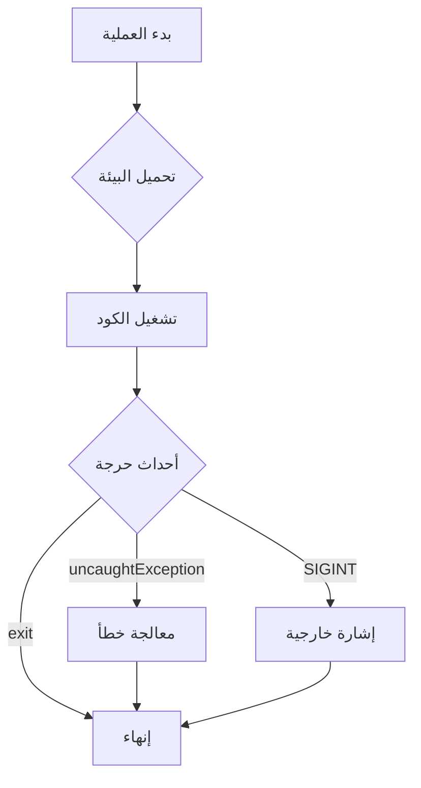

# process (إدارة العمليات في Node.js)

---

## الوصف
موديول `process` يوفر واجهة شاملة للتعامل مع عملية Node.js الحالية: معلومات النظام، البيئة، إدارة الإنهاء، التعامل مع الإشارات، الأحداث الحرجة، التحكم في تدفق التنفيذ، إدارة الموارد، والمزيد. يُستخدم في جميع تطبيقات Node.js تقريبًا.

---

## فهرس الخصائص والدوال (جدول سريع)
| الخاصية/الدالة | الوصف | متوافق منذ |
|---------------|-------|------------|
| [`process.argv`](#processargv) | وسيطات التشغيل | دائمًا |
| [`process.env`](#processenv) | متغيرات البيئة | دائمًا |
| [`process.exit([code])`](#processexitcode) | إنهاء العملية | دائمًا |
| [`process.cwd()`](#processcwd) | المسار الحالي | دائمًا |
| [`process.chdir(dir)`](#processchdirdir) | تغيير المسار الحالي | دائمًا |
| [`process.pid`/`process.ppid`](#processpid-ppid) | معرف العملية والأب | دائمًا |
| [`process.platform`/`process.arch`](#processplatform-arch) | منصة النظام والمعمارية | دائمًا |
| [`process.memoryUsage()`](#processmemoryusage) | إحصائيات الذاكرة | دائمًا |
| [`process.uptime()`](#processuptime) | مدة التشغيل | دائمًا |
| [`process.nextTick(callback)`](#processnexttickcallback) | تنفيذ دالة في الدورة التالية | دائمًا |
| [`process.stdin`/`stdout`/`stderr`](#processstdin-stdout-stderr) | تدفقات الإدخال/الإخراج | دائمًا |
| [`process.on(event, listener)`](#processonevent-listener) | التعامل مع أحداث العملية | دائمًا |
| [`process.abort()`](#processabort) | إنهاء العملية فورًا | v8.0.0 |
| [`process.exitCode`](#processexitcode) | تعيين كود الخروج | v0.11.8 |
| [`process.hrtime()`](#processhrtimetime) | قياس الزمن بدقة نانوية | v0.7.6 |
| [`process.hrtime.bigint()`](#processhrtimebigint) | قياس الزمن بدقة نانوية (BigInt) | v10.7.0 |
| [`process.kill(pid, [signal])`](#processkillpid-signal) | إرسال إشارة لعملية | دائمًا |
| [`process.emitWarning()`](#processemitwarning) | إطلاق تحذير مخصص | v6.0.0 |
| [`process.version`](#processversion) | إصدار Node.js | دائمًا |
| [`process.versions`](#processversions) | جميع الإصدارات الفرعية | دائمًا |
| [`process.arch`](#processplatform-arch) | معمارية النظام | دائمًا |
| [`process.platform`](#processplatform-arch) | منصة النظام | دائمًا |
| [`process.title`](#processtitle) | عنوان العملية | دائمًا |
| [`process.setUncaughtExceptionCaptureCallback(fn)`](#processsetuncaughtexceptioncapturecallbackfn) | التقاط الأخطاء غير المعالجة | v9.3.0 |
| [`process.resourceUsage()`](#processresourceusage) | إحصائيات الموارد | v12.6.0 |
| [`process.cpuUsage([prev])`](#processcpuusageprev) | إحصائيات المعالج | v6.1.0 |
| [`process.getActiveResourcesInfo()`](#processgetactiveresourcesinfo) | الموارد النشطة | v14.10.0 |
| ... | ... | ... |

> **ملاحظة:** القائمة أعلاه مختصرة. جميع الدوال والخصائص غير الموثقة سابقًا ستجدها مفصلة أدناه.

---

## مخطط مرئي (Mermaid) لمسار حياة العملية


---

## شرح الخصائص والدوال الأساسية والموسعة

### process.argv
- **الوصف**: مصفوفة تحتوي على اسم node، اسم السكريبت، ثم جميع الوسيطات.
- **مثال:**
```js
console.log(process.argv); // ["node", "script.js", "arg1", ...]
```

---

### process.env
- **الوصف**: كائن يمثل متغيرات البيئة.
- **مثال:**
```js
console.log(process.env.PATH); // طباعة متغير PATH
```

---

### process.exit([code])
- **code**: كود الخروج (افتراضي 0 = نجاح)
- **الوصف**: ينهي العملية بكود محدد.
- **مثال:**
```js
process.exit(1); // إنهاء مع كود خطأ
```
- **ملاحظة:** يفضل استخدام process.exitCode لتعيين كود الخروج بدون إنهاء فوري.

---

### process.exitCode
- **الوصف**: خاصية لتعيين كود الخروج بدون إنهاء فوري. إذا تم تعيينها، ستخرج العملية بهذا الكود عند الانتهاء الطبيعي.
- **مثال:**
```js
process.exitCode = 2;
// ... كود آخر
```

---

### process.cwd()
- **الوصف**: يرجع المسار الحالي كسلسلة نصية.
- **مثال:**
```js
console.log(process.cwd());
```

---

### process.chdir(dir)
- **dir**: المسار الجديد (String)
- **الوصف**: يغير المسار الحالي (يرمي خطأ إذا لم يوجد).
- **مثال:**
```js
process.chdir('/tmp');
```

---

### process.pid / process.ppid
- **الوصف**: أرقام صحيحة لمعرف العملية والأب.
- **مثال:**
```js
console.log(process.pid, process.ppid);
```

---

### process.platform / process.arch
- **الوصف**: نصوص مثل 'win32', 'linux', 'x64'.
- **مثال:**
```js
console.log(process.platform, process.arch);
```

---

### process.memoryUsage()
- **الوصف**: كائن بإحصائيات الذاكرة (heap, rss, external).
- **مثال:**
```js
console.log(process.memoryUsage());
```

---

### process.uptime()
- **الوصف**: عدد ثواني التشغيل (Number).
- **مثال:**
```js
console.log(process.uptime());
```

---

### process.nextTick(callback)
- **callback**: دالة تُنفذ في أقرب دورة حدث.
- **الوصف**: تنفيذ دالة في الدورة التالية من الحدث.
- **مثال:**
```js
process.nextTick(() => console.log('التالي'));
```

---

### process.stdin / process.stdout / process.stderr
- **الوصف**: كائنات Stream (للقراءة/الكتابة).
- **مثال:**
```js
process.stdin.on('data', data => console.log('أدخلت:', data.toString()));
process.stdout.write('مرحبا!\n');
process.stderr.write('خطأ!\n');
```

---

### process.on(event, listener)
- **event**: اسم الحدث (مثل 'exit', 'uncaughtException', 'SIGINT')
- **listener**: دالة تُنفذ عند وقوع الحدث
- **الوصف**: التعامل مع أحداث العملية.
- **مثال:**
```js
process.on('exit', code => console.log('انتهت العملية بكود:', code));
process.on('uncaughtException', err => console.error('خطأ غير معالج:', err));
```

---

### process.abort()
- **الوصف**: ينهي العملية فورًا ويرسل إشارة abort (core dump).
- **مثال:**
```js
process.abort();
```

---

### process.hrtime([time])
- **الوصف**: قياس الزمن بدقة نانوية (يرجع مصفوفة [ثواني, نانوثانية]).
- **مثال:**
```js
const start = process.hrtime();
setTimeout(() => {
  const diff = process.hrtime(start);
  console.log(`مر ${diff[0]} ثانية و${diff[1]} نانوثانية`);
}, 1000);
```

---

### process.hrtime.bigint()
- **الوصف**: قياس الزمن بدقة نانوية (يرجع BigInt).
- **مثال:**
```js
const start = process.hrtime.bigint();
setTimeout(() => {
  const diff = process.hrtime.bigint() - start;
  console.log(`مر ${diff} نانوثانية`);
}, 1000);
```

---

### process.kill(pid, [signal])
- **pid**: معرف العملية
- **signal**: إشارة (افتراضي SIGTERM)
- **الوصف**: إرسال إشارة لعملية أخرى.
- **مثال:**
```js
process.kill(12345, 'SIGINT');
```

---

### process.emitWarning(warning[, options])
- **warning**: نص التحذير
- **options**: كائن خيارات (type, code, ctor)
- **الوصف**: إطلاق تحذير مخصص يظهر في stderr.
- **مثال:**
```js
process.emitWarning('تحذير مخصص', { type: 'CustomWarning', code: 'MY_WARN' });
```

---

### process.version / process.versions
- **الوصف**: إصدار Node.js وجميع الإصدارات الفرعية (V8, openssl ...)
- **مثال:**
```js
console.log(process.version);
console.log(process.versions);
```

---

### process.title
- **الوصف**: عنوان العملية (يمكن تغييره ويظهر في إدارة المهام)
- **مثال:**
```js
process.title = 'MyApp';
```

---

### process.setUncaughtExceptionCaptureCallback(fn)
- **fn**: دالة تُنفذ عند وجود خطأ غير معالج
- **الوصف**: التقاط الأخطاء غير المعالجة بدل إنهاء العملية.
- **مثال:**
```js
process.setUncaughtExceptionCaptureCallback((err) => {
  console.error('تم التقاط خطأ:', err);
});
```

---

### process.resourceUsage()
- **الوصف**: إحصائيات استخدام الموارد (CPU, memory, I/O ...)
- **مثال:**
```js
console.log(process.resourceUsage());
```

---

### process.cpuUsage([previousValue])
- **previousValue**: كائن سابق (اختياري)
- **الوصف**: إحصائيات استخدام المعالج منذ بدء العملية أو منذ previousValue.
- **مثال:**
```js
console.log(process.cpuUsage());
```

---

### process.getActiveResourcesInfo()
- **الوصف**: جلب قائمة الموارد النشطة (debugging)
- **مثال:**
```js
console.log(process.getActiveResourcesInfo());
```

---

## مقارنة بين بعض الدوال المتشابهة
| الدالة | متى تستخدمها؟ |
|--------|---------------|
| `process.exit()` | لإنهاء العملية فورًا (نادرًا) |
| `process.exitCode` | لتعيين كود الخروج بدون إنهاء فوري |
| `process.nextTick()` | لتنفيذ دالة بعد انتهاء الكود الحالي مباشرة |
| `setImmediate()` | لتنفيذ دالة في الدورة التالية من الـ event loop |
| `process.hrtime()` | لقياس الزمن بدقة عالية |
| `Date.now()` | لقياس الزمن بدقة ميلي ثانية |

---

## حالات الاستخدام الشائعة
- بناء تطبيقات CLI
- التعامل مع متغيرات البيئة
- مراقبة استهلاك الموارد
- التعامل مع الأحداث الحرجة (exit, uncaughtException, SIGINT)
- إدارة عمليات فرعية
- مراقبة الأداء

---

## أفضل الممارسات
- لا تستخدم process.exit() إلا عند الضرورة القصوى
- سجل جميع الأخطاء الحرجة (uncaughtException, unhandledRejection)
- استخدم process.env فقط لقراءة متغيرات البيئة
- راقب استهلاك الذاكرة والدورات الزمنية في التطبيقات طويلة الأمد
- استخدم process.nextTick بحذر
- تحقق من وجود المسار قبل استخدام chdir
- تعامل مع جميع الأحداث الحرجة (exit, SIGINT, uncaughtException)

---

## التحذيرات الأمنية
- لا تعرض متغيرات البيئة الحساسة في السجلات أو رسائل الخطأ
- لا تعتمد على platform/arch في منطق حساس بدون اختبار عبر جميع الأنظمة
- أغلق جميع الموارد قبل استخدام process.exit
- لا تستخدم process.kill مع PID غير موثوق

---

## أدوات التصحيح المتعلقة
- [node --inspect](https://nodejs.org/en/docs/guides/debugging-getting-started/)
- [why-is-node-running](https://www.npmjs.com/package/why-is-node-running) (لمعرفة سبب استمرار العملية)
- [clinic.js](https://clinicjs.org/) (تحليل الأداء)

---

## توافق الإصدارات
- معظم الخصائص الأساسية متوفرة منذ الإصدارات الأولى
- خصائص مثل resourceUsage, getActiveResourcesInfo, setUncaughtExceptionCaptureCallback متوفرة في الإصدارات الحديثة فقط
- راجع [توثيق Node.js الرسمي - process](https://nodejs.org/docs/latest/api/process.html) لأي تحديثات

---

## اختبار تفاعلي
```js
const test = require('node:test');
const assert = require('node:assert');

test('اختبار argv', () => {
  assert.ok(Array.isArray(process.argv));
});

test('اختبار memoryUsage', () => {
  const mem = process.memoryUsage();
  assert.ok(mem.heapUsed > 0);
});
```

---

## نصائح الخبراء
- راقب استهلاك الموارد بشكل دوري في التطبيقات طويلة الأمد
- استخدم process.hrtime لقياس الأداء بدقة
- تعامل مع جميع الأحداث الحرجة لتجنب توقف التطبيق فجأة
- استخدم process.emitWarning لإطلاق تحذيرات مخصصة أثناء التطوير
- استخدم أدوات مراقبة خارجية مع process للمشاريع الكبيرة

---

## ملاحظات تقنية
- الأحداث الحرجة: 'exit', 'uncaughtException', 'SIGINT', 'SIGTERM', 'warning'
- استخدم process.memoryUsage لمراقبة التسريبات
- استخدم process.hrtime لقياس الزمن بدقة نانوية
- راجع [توثيق Node.js الرسمي - process](https://nodejs.org/docs/latest/api/process.html) لأي تحديثات 

---

## أمثلة شاملة متقدمة

### مثال 1: مراقبة استهلاك الذاكرة والمعالج في تطبيق طويل الأمد
```js
setInterval(() => {
  const mem = process.memoryUsage();
  const cpu = process.cpuUsage();
  console.log('الذاكرة:', mem.rss, 'المعالج:', cpu.user);
}, 5000);
```
**شرح:** يوضح كيفية مراقبة الموارد بشكل دوري.

---

### مثال 2: التعامل مع الإشارات (signals) لإغلاق التطبيق بأمان
```js
process.on('SIGINT', () => {
  console.log('تم استقبال SIGINT، إنهاء التطبيق بأمان...');
  process.exit(0);
});
```
**شرح:** يوضح كيفية التقاط إشارات النظام.

---

### مثال 3: تنفيذ دوال متسلسلة باستخدام process.nextTick
```js
function step1() { console.log('الخطوة 1'); }
function step2() { console.log('الخطوة 2'); }
process.nextTick(step1);
step2();
// النتيجة: الخطوة 2 ثم الخطوة 1
```
**شرح:** يوضح ترتيب التنفيذ مع nextTick.

---

### مثال 4: التعامل مع الأخطاء غير المعالجة
```js
process.on('uncaughtException', err => {
  console.error('خطأ غير معالج:', err);
  process.exit(1);
});
throw new Error('اختبار');
```
**شرح:** يوضح كيفية التقاط الأخطاء غير المعالجة.

---

### مثال 5: تغيير متغيرات البيئة أثناء التشغيل
```js
process.env.MY_VAR = 'test';
console.log('MY_VAR:', process.env.MY_VAR);
```
**شرح:** يوضح كيفية تعديل متغيرات البيئة ديناميكياً.

--- 