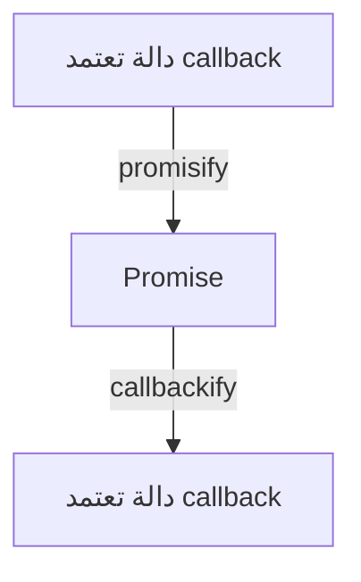

# util (أدوات مساعدة)

## الوصف
وحدة util توفر مجموعة من الأدوات المساعدة التي تُستخدم داخليًا في Node.js، لكنها مفيدة جدًا لمطوري التطبيقات والمكتبات. تشمل أدوات للتحويل بين الأنماط البرمجية (callback <-> promise)، تنسيق النصوص، فحص الكائنات، مقارنة القيم، التعامل مع الترميز، والمزيد.

---

## فهرس الدوال
| الدالة | الوصف |
|--------|-------|
| [`util.promisify`](#utilpromisify) | تحويل callback إلى Promise |
| [`util.callbackify`](#utilcallbackify) | تحويل Promise إلى callback |
| [`util.format`](#utilformat) | تنسيق نصوص |
| [`util.formatWithOptions`](#utilformatwithoptions) | تنسيق نصوص مع خيارات |
| [`util.inspect`](#utilinspect) | طباعة كائنات |
| [`util.deprecate`](#utildeprecate) | تحذير دوال قديمة |
| [`util.debuglog`](#utildebuglog) | رسائل تصحيح |
| [`util.isDeepStrictEqual`](#utilisdeepstrictequal) | مقارنة عميقة |
| [`util.parseArgs`](#utilparseargs) | تحليل وسيطات سطر الأوامر |
| [`util.parseEnv`](#utilparseenv) | تحليل متغيرات البيئة |
| [`util.getSystemErrorName`](#utilgetsystemerrorname) | اسم خطأ النظام |
| [`util.getSystemErrorMap`](#utilgetsystemerrormap) | خريطة أخطاء النظام |
| [`util.getSystemErrorMessage`](#utilgetsystemerrormessage) | رسالة خطأ النظام |
| [`util.inherits`](#utilinherits) | وراثة كائنات |
| [`util.stripVTControlCharacters`](#utilstripvtcontrolcharacters) | إزالة رموز التحكم |
| [`util.styleText`](#utilstyletext) | تلوين النصوص |
| [`util.TextEncoder`](#utiltextencoder) / [`util.TextDecoder`](#utiltextdecoder) | ترميز/فك ترميز النصوص |
| [`util.MIMEType`](#utilmimetype) | تحليل نوع MIME |
| [`util.MIMEParams`](#utilmimeparams) | إدارة بارامترات MIME |
| [`util.toUSVString`](#utiltousvstring) | تحويل نص إلى Unicode |

---

## شرح الدوال الأساسية

### util.promisify(original)
- **original**: دالة تعتمد callback (function)
- **الوصف**: يحول دالة تعتمد أسلوب callback إلى دالة تعيد Promise.
- **مثال:**
```js
const util = require('util');
const fs = require('fs');
const readFileAsync = util.promisify(fs.readFile);
readFileAsync('file.txt', 'utf8').then(console.log);
```
[توثيق رسمي](https://nodejs.org/docs/latest/api/util.html#util_util_promisify_original)

---

### util.callbackify(original)
- **original**: دالة تعيد Promise
- **الوصف**: يحول دالة Promise إلى دالة تعتمد callback.
- **مثال:**
```js
const util = require('util');
async function fn() { return 'ok'; }
const cb = util.callbackify(fn);
cb((err, val) => console.log(val));
```
[توثيق رسمي](https://nodejs.org/docs/latest/api/util.html#util_util_callbackify_original)

---

### util.format(format, ...args)
- **format**: سلسلة تنسيق (مثل %s, %d)
- **...args**: القيم المراد إدراجها
- **الوصف**: تنسيق نصوص مشابه لـ printf.
- **مثال:**
```js
console.log(util.format('عدد: %d, نص: %s', 5, 'test'));
```
[توثيق رسمي](https://nodejs.org/docs/latest/api/util.html#util_util_format_format_args)

---

### util.formatWithOptions(inspectOptions, format, ...args)
- **inspectOptions**: كائن خيارات لفحص الكائنات (مثل { colors: true })
- **format**: سلسلة تنسيق
- **...args**: القيم المراد إدراجها
- **الوصف**: مثل util.format لكن يسمح بتخصيص طريقة عرض الكائنات.
- **مثال:**
```js
console.log(util.formatWithOptions({ colors: true }, 'الكائن: %O', { a: 1 }));
```
[توثيق رسمي](https://nodejs.org/docs/latest/api/util.html#util_util_formatwithoptions_inspectoptions_format_args)

---

### util.inspect(object[, options])
- **object**: الكائن المراد طباعته
- **options**: خيارات العرض (مثل { depth, colors })
- **الوصف**: طباعة كائنات بشكل منسق (مفيد للتصحيح).
- **مثال:**
```js
console.log(util.inspect({a:1, b:[2,3]}, { colors: true }));
```
[توثيق رسمي](https://nodejs.org/docs/latest/api/util.html#util_util_inspect_object_options)

---

### util.deprecate(fn, msg[, code])
- **fn**: الدالة القديمة
- **msg**: رسالة التحذير
- **code**: كود التحذير (اختياري)
- **الوصف**: يطبع تحذير عند استدعاء دالة قديمة.
- **مثال:**
```js
const old = util.deprecate(() => {}, 'هذه الدالة مهملة!');
old();
```
[توثيق رسمي](https://nodejs.org/docs/latest/api/util.html#util_util_deprecate_fn_msg_code)

---

### util.debuglog(section[, callback])
- **section**: اسم القسم (string)
- **callback**: دالة تُستدعى عند التفعيل (اختياري)
- **الوصف**: يطبع رسائل تصحيح عند تفعيل متغير NODE_DEBUG.
- **مثال:**
```js
const debug = util.debuglog('myapp');
debug('رسالة تصحيح'); // تظهر فقط إذا NODE_DEBUG=myapp
```
[توثيق رسمي](https://nodejs.org/docs/latest/api/util.html#util_util_debuglog_section_callback)

---

### util.isDeepStrictEqual(val1, val2)
- **val1, val2**: القيم المراد مقارنتها
- **الوصف**: مقارنة عميقة (strict) بين قيمتين.
- **مثال:**
```js
console.log(util.isDeepStrictEqual({a:1}, {a:1})); // true
```
[توثيق رسمي](https://nodejs.org/docs/latest/api/util.html#util_util_isdeepstrictequal_val1_val2)

---

### util.parseArgs([config])
- **config**: كائن إعدادات (تعريف الخيارات، القيم الافتراضية، ...)
- **الوصف**: يحلل وسيطات سطر الأوامر ويعيد كائن يمثل الخيارات والقيم. (يتطلب Node.js 18+)
- **مثال:**
```js
const args = util.parseArgs({ options: { foo: { type: 'string' } } });
console.log(args.values.foo);
```
[توثيق رسمي](https://nodejs.org/docs/latest/api/util.html#util_util_parseargs_config)

---

### util.parseEnv(content)
- **content**: نص يحتوي على متغيرات بيئة (مثل ملف .env)
- **الوصف**: يحلل النص ويعيد كائن يمثل متغيرات البيئة. (يتطلب Node.js 20+)
- **مثال:**
```js
console.log(util.parseEnv('API_KEY=123\nDEBUG=true'));
```
[توثيق رسمي](https://nodejs.org/docs/latest/api/util.html#util_util_parseenv_content)

---

### util.getSystemErrorName(err)
- **err**: رقم أو كود الخطأ (integer)
- **الوصف**: يعيد اسم الخطأ البشري المقابل لرقم الخطأ من النظام (مثلاً 'EADDRINUSE').
- **مثال:**
```js
console.log(util.getSystemErrorName(98));
```
[توثيق رسمي](https://nodejs.org/docs/latest/api/util.html#util_util_getsystemerrorname_err)

---

### util.getSystemErrorMap()
- **الوصف**: يعيد Map فيها جميع رموز أخطاء النظام مع تفاصيلها (اسم، رسالة).
- **مثال:**
```js
console.log(util.getSystemErrorMap().get(98));
```
[توثيق رسمي](https://nodejs.org/docs/latest/api/util.html#util_util_getsystemerrormap)

---

### util.getSystemErrorMessage(err)
- **err**: رقم أو كود الخطأ (integer)
- **الوصف**: يعيد رسالة الخطأ النصية المقابلة لرقم الخطأ من النظام.
- **مثال:**
```js
console.log(util.getSystemErrorMessage(98));
```
[توثيق رسمي](https://nodejs.org/docs/latest/api/util.html#util_util_getsystemerrormessage_err)

---

### util.inherits(constructor, superConstructor)
- **constructor**: الدالة البانية (function) للكائن الجديد
- **superConstructor**: الدالة البانية للكائن الأب
- **الوصف**: يربط النموذج prototype للكائن الجديد مع الكائن الأب (أسلوب وراثة قديم).
- **مثال:**
```js
function A() {}
function B() {}
util.inherits(B, A);
```
[توثيق رسمي](https://nodejs.org/docs/latest/api/util.html#util_util_inherits_constructor_superconstructor)

---

### util.stripVTControlCharacters(str)
- **str**: النص المراد تنظيفه
- **الوصف**: يزيل رموز التحكم (مثل ألوان الطرفية) من النص.
- **مثال:**
```js
console.log(util.stripVTControlCharacters('\u001b[31mنص\u001b[39m'));
```
[توثيق رسمي](https://nodejs.org/docs/latest/api/util.html#util_util_stripvtcontrolcharacters_str)

---

### util.styleText(format, text[, options])
- **format**: نوع التنسيق (مثل 'bold', 'redBG')
- **text**: النص المراد تلوينه
- **options**: خيارات إضافية (اختياري)
- **الوصف**: يضيف أكواد ANSI لتلوين النص في الطرفية.
- **مثال:**
```js
console.log(util.styleText('bold', 'نص عريض'));
```
[توثيق رسمي](https://nodejs.org/docs/latest/api/util.html#util_util_styletext_format_text_options)

---

### util.TextEncoder / util.TextDecoder
- **TextEncoder**: ترميز النصوص إلى Uint8Array (عادة UTF-8)
- **TextDecoder**: فك ترميز Uint8Array إلى نص (يدعم عدة ترميزات)
- **المعاملات**: encoding, options
- **مثال:**
```js
const enc = new util.TextEncoder();
const arr = enc.encode('abc');
const dec = new util.TextDecoder();
console.log(dec.decode(arr));
```
[توثيق رسمي](https://nodejs.org/docs/latest/api/util.html#class-utiltextencoder)

---

### util.MIMEType(input)
- **input**: نص نوع MIME (مثل 'text/html; charset=utf-8')
- **الوصف**: ينشئ كائن يمثل نوع MIME مع إمكانية الوصول للنوع، الفرع، البارامترات.
- **مثال:**
```js
const mime = new util.MIMEType('text/html; charset=utf-8');
console.log(mime.type, mime.subtype, mime.params.get('charset'));
```
[توثيق رسمي](https://nodejs.org/docs/latest/api/util.html#class-utilmimetype)

---

### util.MIMEParams
- **الوصف**: كائن لإدارة بارامترات MIME (get, set, has, delete, entries, ...)
- **مثال:**
```js
const mime = new util.MIMEType('text/html; charset=utf-8');
for (const [k, v] of mime.params) console.log(k, v);
```
[توثيق رسمي](https://nodejs.org/docs/latest/api/util.html#class-utilmimeparams)

---

### util.toUSVString(string)
- **string**: نص عادي
- **الوصف**: يحول النص إلى Unicode Scalar Value string (يصلح للواجهات الحديثة).
- **مثال:**
```js
console.log(util.toUSVString('abc'));
```
[توثيق رسمي](https://nodejs.org/docs/latest/api/util.html#util_util_tousvstring_string)

---

## ملاحظات حول الاستقرار والتوافق
- جميع الدوال هنا مستقرة (Stability: 2) إلا ما تم الإشارة إليه.
- بعض الدوال تتطلب Node.js 18+ أو 20+ (تم توضيح ذلك).
- راجع [توثيق Node.js الرسمي](https://nodejs.org/docs/latest/api/util.html) لأي تحديثات.

---

## حالات الاستخدام الشائعة
- تحويل دوال callback إلى Promises في مشاريع حديثة
- تنسيق رسائل السجلات أو الأخطاء
- طباعة كائنات معقدة أثناء التصحيح
- مقارنة كائنات عميقة في الاختبارات
- التعامل مع ترميز النصوص (TextEncoder/TextDecoder)

---

## أفضل الممارسات
- استخدم util.promisify لتحديث الكود القديم تدريجيًا
- استخدم util.inspect فقط في التصحيح وليس في الإنتاج
- استخدم util.deprecate لتنبيه المستخدمين عند التخلي عن دوال
- راقب أداء util.format في الحلقات الكبيرة

---

## التحذيرات الأمنية
- لا تطبع كائنات تحتوي على أسرار أو بيانات حساسة باستخدام util.inspect
- لا تعرض رسائل util.format مباشرة للمستخدم النهائي إذا كانت تحتوي على مدخلات خارجية

---

## أدوات التصحيح المتعلقة
- [node --inspect](https://nodejs.org/en/docs/guides/debugging-getting-started/)
- util.debuglog (لرسائل التصحيح المشروطة)

---

## مخطط تدفق (Mermaid)


---

## اختبار تفاعلي
```js
const test = require('node:test');
const assert = require('node:assert');
const util = require('util');

test('اختبار util.isDeepStrictEqual', () => {
  assert(util.isDeepStrictEqual({a:1}, {a:1}));
  assert(!util.isDeepStrictEqual({a:1}, {a:2}));
});
```

---

## الأخطاء الشائعة
- [❌] نسيان معالجة الأخطاء عند استخدام الدوال المحولة بـ promisify → الحل: استخدم try/catch مع async/await.
- [❌] طباعة كائنات ضخمة أو حساسة بـ util.inspect في الإنتاج → الحل: استخدمها فقط أثناء التطوير.
- [❌] الاعتماد على util.deprecate دون توثيق بديل واضح → الحل: وضّح البدائل في الرسائل.

---

## نصائح الخبراء
- [💡] استخدم util.promisify لتسهيل الانتقال إلى async/await.
- [🚀] استخدم util.format لتوحيد رسائل السجلات.
- [⚠️] لا تعرض رسائل util.inspect أو util.format للمستخدم النهائي إذا كانت تحتوي على بيانات حساسة.
- [💡] استخدم util.debuglog لتفعيل رسائل التصحيح فقط عند الحاجة (NODE_DEBUG=اسم_القسم). 

---

## أمثلة شاملة متقدمة

### مثال 1: تحويل جميع دوال fs القديمة إلى وعود (Promises) واستخدامها مع async/await
```js
const util = require('util');
const fs = require('fs');
const readFileAsync = util.promisify(fs.readFile);
const writeFileAsync = util.promisify(fs.writeFile);
async function copyFile(src, dest) {
  try {
    const data = await readFileAsync(src, 'utf8');
    await writeFileAsync(dest, data);
    console.log('تم النسخ بنجاح!');
  } catch (err) {
    console.error('خطأ في النسخ:', err);
  }
}
copyFile('a.txt', 'b.txt');
```
**شرح:** يوضح كيفية تحويل دوال callback إلى وعود واستخدامها مع async/await.

---

### مثال 2: تنسيق رسائل السجلات مع معلومات متقدمة
```js
const util = require('util');
const user = { id: 1, name: 'أحمد' };
console.log(util.format('مستخدم: %O', user));
console.log(util.formatWithOptions({ colors: true }, 'تفاصيل: %O', user));
```
**شرح:** يوضح الفرق بين format وformatWithOptions.

---

### مثال 3: طباعة كائنات معقدة مع خيارات متقدمة
```js
const util = require('util');
const obj = { a: 1, b: { c: [2, 3, { d: 4 }] } };
console.log(util.inspect(obj, { depth: null, colors: true }));
```
**شرح:** يوضح كيفية طباعة كائنات متداخلة مع خيارات العرض.

---

### مثال 4: مقارنة كائنات عميقة في الاختبارات
```js
const util = require('util');
const assert = require('assert');
const a = { x: 1, y: [2, 3] };
const b = { x: 1, y: [2, 3] };
assert(util.isDeepStrictEqual(a, b));
```
**شرح:** يوضح استخدام isDeepStrictEqual في الاختبارات.

---

### مثال 5: التعامل مع ترميز النصوص وتحويلها
```js
const util = require('util');
const enc = new util.TextEncoder();
const arr = enc.encode('مرحبا');
const dec = new util.TextDecoder();
console.log(dec.decode(arr));
```
**شرح:** يوضح كيفية ترميز النصوص وفك ترميزها.

--- 